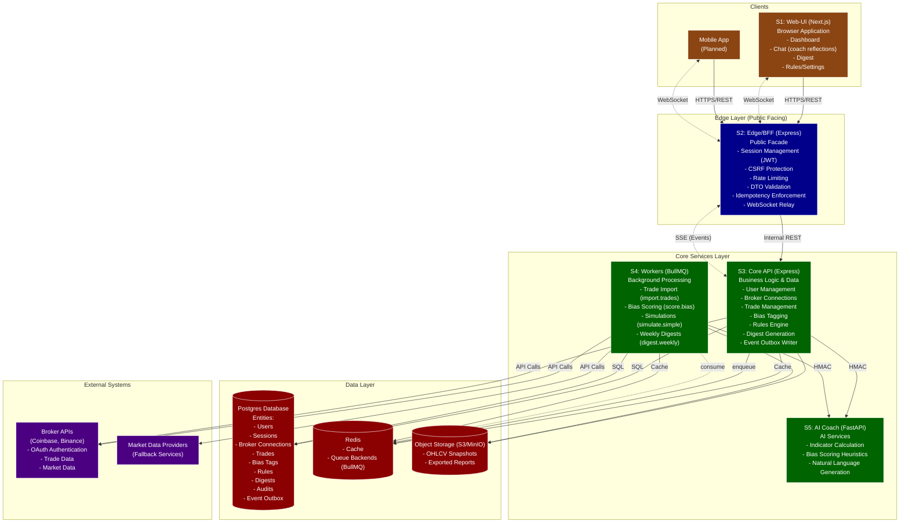

# System Architecture Diagram

This diagram shows the complete architecture of the trading platform, including all five main stacks and their interactions.

## Component Responsibilities

### S1: Web-UI (Next.js)
- User-facing web application
- Dashboard with trading insights
- Chat interface for coach reflections
- Weekly digest viewer
- Rules and settings management
- Uses cookie-based sessions (no direct DB access)
- Communicates with Edge via REST and WebSocket

### S2: Edge/BFF (Express)
- Public API facade for web and mobile clients
- Session management with JWT tokens
- CSRF protection and rate limiting
- DTO validation and idempotency enforcement
- WebSocket relay with event replay capability
- No direct database access - proxies requests to Core API

### S3: Core API (Express)
- Central business logic and data management
- User, session, and broker connection management
- Trade and bias tag handling
- Rules engine and digest generation
- Event outbox writer for all user events
- Internal REST API consumed by Edge
- Enqueues background jobs for Workers

### S4: Workers (BullMQ)
- Background job processing
- Trade import from broker APIs
- Bias scoring using AI Coach service
- Trade simulations
- Weekly digest generation
- Uses Redis for job queues and caching

### S5: AI Coach (FastAPI)
- Provides AI-powered services to Core and Workers
- Calculates trading indicators
- Applies heuristic bias scoring
- Generates natural language reflections
- Secured with HMAC-signed requests

### Data Layer
- Postgres: Primary database with all business entities
- Redis: Caching and job queue backends
- S3: Object storage for snapshots and reports

### External Systems
- Broker APIs: Primary source of trading data
- Market Data Providers: Fallback data sources