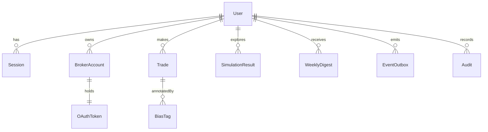

# 02 — Data & ERD (Core Entities)

## Entities
- **User**(id, email, passwordHash?, createdAt)
- **Session**(id, userId, createdAt, expiresAt)
- **BrokerAccount**(id, userId, broker, status, createdAt)
- **OAuthToken**(id, brokerAccountId, accessEnc, refreshEnc, scope, createdAt, updatedAt)
- **Trade**(id, userId, broker, extId, symbol, side, qty, price, fee?, ts, createdAt, updatedAt)
- **BiasTag**(id, tradeId, label[FOMO|PANIC|DISCIPLINE|NEUTRAL], confidence, features(jsonb), createdAt)
- **SimulationResult**(id, userId, tradeId, horizonDays, deltaPnl, params(jsonb), createdAt)
- **WeeklyDigest**(id, userId, periodStart, periodEnd, stats(jsonb), url?)
- **EventOutbox**(eventId, type, v, ts, userId, payload(jsonb), deliveredAt?)
- **Audit**(id, userId?, action, ipHash, uaHash, ts)

## ERD (Mermaid)

