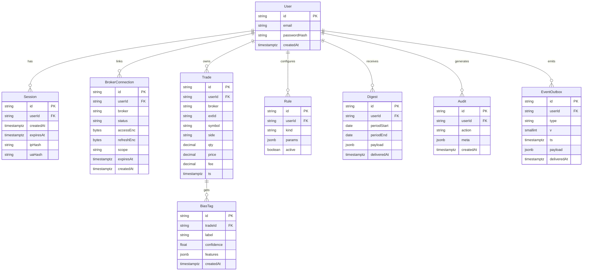

# 02 — Data & ERD (Canonical Entities + Constraints)

> Field names are **authoritative** across S1–S5. Keep identical in DTOs/ORM.

## Entities

**User**

* `id` (nanoid, PK)
* `email` (unique)
* `passwordHash` (Argon2id)
* `createdAt` (timestamptz)

**Session**

* `id` (nanoid, PK)
* `userId` (FK → User)
* `createdAt`, `expiresAt` (timestamptz)
* `ipHash` (sha256(IP+pepper)), `uaHash` (nullable)

**BrokerConnection**

* `id` (nanoid, PK), `userId` (FK → User)
* `broker` (`coinbase` | `binance` | …)
* `status` (`active`|`paused`|`revoked`)
* `accessEnc` (bytes, AES-GCM), `refreshEnc` (bytes, nullable)
* `scope` (string), `expiresAt` (nullable), `createdAt`

**Trade**

* `id` (nanoid, PK), `userId` (FK → User)
* `broker` (string), `extId` (broker trade id)
* `symbol` (string), `side` (`BUY`|`SELL`)
* `qty` (decimal), `price` (decimal), `fee` (decimal, nullable)
* `ts` (timestamptz)
* **Constraint**: `UNIQUE (userId, broker, extId)`

**BiasTag**

* `id` (nanoid, PK), `tradeId` (FK → Trade)
* `label` (`FOMO`|`PANIC`|`DISCIPLINE`|…)
* `confidence` (float 0..1)
* `features` (jsonb; compact feature summary)
* `createdAt` (timestamptz)

**Rule**

* `id` (nanoid, PK), `userId` (FK → User)
* `kind` (e.g., `avoidSpikeOverPct`)
* `params` (jsonb; e.g., `{ pct: 10, lookbackHours: 24 }`)
* `active` (boolean, default true)

**Digest**

* `id` (nanoid, PK), `userId` (FK → User)
* `periodStart` (date), `periodEnd` (date)
* `payload` (jsonb; counts by bias, P/L attribution, streaks, suggestion)
* `deliveredAt` (timestamptz, nullable)

**Audit**

* `id` (nanoid, PK), `userId` (FK → User)
* `action` (`login`, `broker_linked`, `import_start`, `import_done`, …)
* `meta` (jsonb), `createdAt` (timestamptz)

**EventOutbox**

* `id` (ULID, PK), `userId` (FK → User)
* `type` (`coach.reflect` | `import.progress` | `digest.ready`)
* `v` (smallint, schema version)
* `ts` (timestamptz; **monthly partition key**)
* `payload` (jsonb)
* `deliveredAt` (timestamptz, nullable)

## ERD (Mermaid)

## Indices & Constraints

* `Trade UNIQUE(userId, broker, extId)`
* Indexes:

  * `Trade(userId, ts)`, `Trade(symbol)`
  * `BiasTag(tradeId)`
  * `Digest(userId, periodEnd)`
  * `EventOutbox(userId, ts)` (monthly partitions on `ts`)

## Data Lifecycle

* **Tokens:** `accessEnc`/`refreshEnc` sealed with AES-GCM (per-tenant DEK; KEK via KMS).
* **Events:** `EventOutbox` retained 90 days; monthly partitions pruned.
* **Digests:** keep 6 months in Postgres; older archived to S3 as JSON.
* **Exports:** generated to S3; signed URL with short TTL.
* **Deletion:** hard-delete tokens & sessions; (optional) soft-delete trades if adopted and stated in privacy copy.

## Field Sensitivity

| Entity.Field           | Sensitivity  | Notes                                       |
| ---------------------- | ------------ | ------------------------------------------- |
| User.email             | PII          | Never exposed publicly; hash in logs        |
| BrokerConnection.\*Enc | Secret       | AES-GCM sealed; never logged                |
| Session.ipHash/uaHash  | Pseudonymous | Derived; raw IP/UA not stored               |
| Trade.price/qty/fee    | Financial    | Needed for analytics; export/delete covered |
| BiasTag.features       | Low          | Keep compact; no PII                        |
| EventOutbox.payload    | Low/Med      | Avoid tokens/PII                            |
