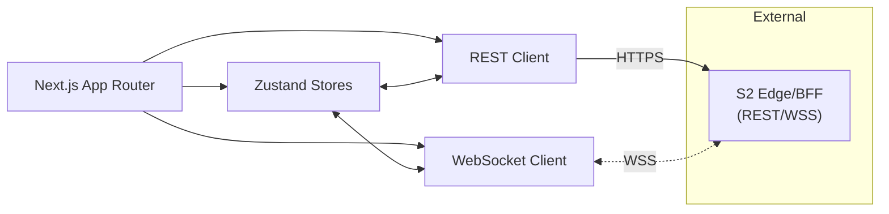
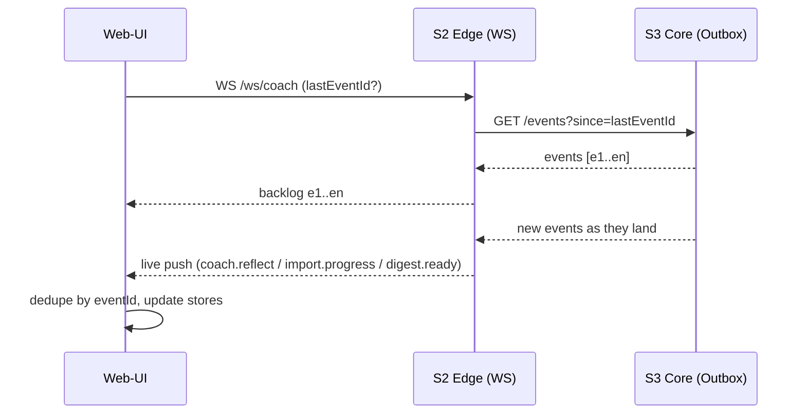

# 03 — Stack 1: Web-UI (Next.js) — Structure, Diagrams, Pseudocode

## Purpose & Responsibilities

* Desktop UI for: **Chat (coach reflections), Dashboard, Weekly Digest, Rules/Settings**.
* Uses **cookie-based session** set by S2 (Edge/BFF). **No direct DB access.**
* Talks to S2 over **HTTPS (REST)** and **WSS** for real-time events.
* Implements **resume** via `lastEventId` for event replay.
* Enforces **secure defaults** (no localStorage tokens, CSP-friendly).

---

## Architecture (Mermaid)

### Module map



### Event resume (sequence)



---

## Public Contracts (to S2 Edge)

* **REST (JSON)**

  * `POST /auth/signup`, `POST /auth/login`, `POST /auth/logout`, `GET /auth/me`
  * `POST /brokers/:broker/connect/start`, `GET /brokers/:broker/connect/callback`
  * `POST /trades/import` *(send `Idempotency-Key` header; include `X-CSRF-Token`)*
  * `GET /trades?since&until&cursor&limit`
  * `GET /trades/:id/bias`
  * `POST /simulations/simple` *(body per `SimulationRequest`)*
  * `GET /digests/weekly/latest`
  * `GET /rules`, `POST /rules/upsert`
  * `GET /events?since=:eventId` *(replay backlog)*

* **WSS**

  * Path: `/ws/coach`
  * Messages: `{ type, eventId, ts, v, payload }`

    * `coach.reflect` → new reflection for a trade
    * `import.progress` → progress bar updates
    * `digest.ready` → weekly digest card available

* **CSRF**

  * S2 exposes a non-HttpOnly cookie (e.g., `csrf_token`) → UI sends header `X-CSRF-Token`.

---

## Project Structure (copy, then fill)

```
apps/web/
  src/
    app/
      layout.tsx
      page.tsx                      # Dashboard (bias timeline / trades grid)
      chat/page.tsx                 # Chat hub
      digest/page.tsx               # Weekly digest view
      settings/page.tsx             # Rules, account, export/delete
      api/healthcheck/route.ts      # (optional) local probe
    components/
      shell/
        AppHeader.tsx
        AppSidebar.tsx
      chat/
        ChatPanel.tsx
        ReflectBubble.tsx
        SimulationModal.tsx
      dashboard/
        BiasRadar.tsx
        TradesGrid.tsx
      digest/
        DigestCard.tsx
        DigestDetail.tsx
      settings/
        RuleEditor.tsx
        DangerZone.tsx
      common/
        Button.tsx
        Spinner.tsx
        EmptyState.tsx
    lib/
      apiClient.ts                  # REST client with DTOs & CSRF/Idempotency helpers
      wsClient.ts                   # WSS client with resume & backpressure
      dto.ts                        # TS mirrors of shared Zod DTOs (read-only mirror)
      format.ts                     # money/time helpers
      guard.ts                      # route guards, session check
    stores/
      session.store.ts              # user/session state
      events.store.ts               # WS connection, lastEventId
      trades.store.ts               # normalized trades, by id
      reflections.store.ts          # list keyed by tradeId
      digest.store.ts               # latest digest payload
      rules.store.ts                # rules list, toggles
    styles/
      globals.css
    tests/
      unit/
      e2e/
  package.json
  tsconfig.json
```

---

## Key Types (UI mirrors canonical entities)

> These match **02 — Data & ERD** (keep names/fields identical).

```ts
// lib/dto.ts — simplified UI types (read-only mirror of shared DTOs)
export type Trade = {
  id: string; userId: string; broker: string; extId: string;
  symbol: string; side: 'BUY'|'SELL'; qty: number; price: number; fee?: number; ts: string
};

export type BiasTag = {
  id: string; tradeId: string; label: 'FOMO'|'PANIC'|'DISCIPLINE';
  confidence: number; features: Record<string, unknown>; createdAt: string
};

export type Digest = {
  id: string; userId: string;
  periodStart: string; periodEnd: string;
  payload: any; deliveredAt?: string | null
};

export type Rule = {
  id: string; userId: string; kind: string;
  params: Record<string, unknown>; active: boolean
};

export type CoachEvent =
  | { type: 'coach.reflect'; eventId: string; ts: string; v: number;
      payload: { tradeId: string; labels: { name: string; confidence: number }[]; insight: string; sparklines?: any; tone: 'supportive'|'strict' } }
  | { type: 'import.progress'; eventId: string; ts: string; v: number; payload: { jobId: string; percent: number; fetched: number; stored: number } }
  | { type: 'digest.ready'; eventId: string; ts: string; v: number; payload: { digestId: string; period: { start: string; end: string } } };
```

---

## Pseudocode — Core Utilities

### `lib/apiClient.ts`

```ts
const BASE = process.env.NEXT_PUBLIC_API_BASE ?? '';

function csrf(): string {
  // read non-HttpOnly csrf cookie set by S2 (e.g., "csrf_token")
  return document.cookie.split('; ').find(c=>c.startsWith('csrf_token='))?.split('=')[1] ?? '';
}

function headers(mutating = false, idemKey?: string): HeadersInit {
  const h: Record<string,string> = { 'Accept': 'application/json', 'Content-Type': 'application/json' };
  if (mutating) h['X-CSRF-Token'] = csrf();
  if (idemKey) h['Idempotency-Key'] = idemKey;
  return h;
}

export async function get<T>(path: string): Promise<T> {
  const res = await fetch(`${BASE}${path}`, { credentials: 'include', headers: headers() });
  if (!res.ok) throw new Error(await res.text());
  return res.json();
}

export async function post<T>(path: string, body: unknown, idemKey?: string): Promise<T> {
  const res = await fetch(`${BASE}${path}`, {
    method: 'POST', credentials: 'include',
    headers: headers(true, idemKey), body: JSON.stringify(body)
  });
  if (!res.ok) throw new Error(await res.text());
  return res.json();
}
```

### `lib/wsClient.ts`

```ts
type Listener = (e: CoachEvent) => void;

export class WSClient {
  private ws?: WebSocket;
  private listeners = new Set<Listener>();
  private lastEventId: string | null = null;
  private url: string;

  constructor(url: string) { this.url = url; }

  on(fn: Listener) { this.listeners.add(fn); return () => this.listeners.delete(fn); }

  private notify(e: CoachEvent) {
    this.lastEventId = e.eventId;
    this.listeners.forEach(l => l(e));
  }

  async connect() {
    const q = this.lastEventId ? `?lastEventId=${encodeURIComponent(this.lastEventId)}` : '';
    this.ws = new WebSocket(`${this.url}${q}`);
    this.ws.onmessage = (m) => this.notify(JSON.parse(m.data));
    this.ws.onclose = () => setTimeout(() => this.connect(), 1000 + Math.random()*1000); // jitter
  }

  async backfill(fetchEvents: (since: string) => Promise<CoachEvent[]>) {
    if (!this.lastEventId) return;
    const backlog = await fetchEvents(this.lastEventId);
    backlog.forEach(e => this.notify(e));
  }
}
```

---

## Stores (Zustand) — Sketches

### `stores/events.store.ts`

```ts
import { create } from 'zustand';

type EventsState = {
  lastEventId: string | null;
  setLastEventId: (id: string) => void;
};
export const useEvents = create<EventsState>((set) => ({
  lastEventId: null,
  setLastEventId: (id) => set({ lastEventId: id })
}));
```

### `stores/trades.store.ts`

```ts
type TradeState = {
  byId: Record<string, Trade>;
  upsertMany: (t: Trade[]) => void;
};
export const useTrades = create<TradeState>((set, get) => ({
  byId: {},
  upsertMany: (arr) => set({ byId: { ...get().byId, ...Object.fromEntries(arr.map(t=>[t.id,t])) } })
}));
```

### `stores/reflections.store.ts`

```ts
type Reflection = { tradeId: string; text: string; labels: { name: string; confidence: number }[]; ts: string };
type ReflectionsState = {
  byTradeId: Record<string, Reflection[]>;
  add: (r: Reflection) => void;
};
export const useReflections = create<ReflectionsState>((set, get) => ({
  byTradeId: {},
  add: (r) => {
    const cur = get().byTradeId[r.tradeId] ?? [];
    set({ byTradeId: { ...get().byTradeId, [r.tradeId]: [...cur, r] } });
  }
}));
```

---

## Pages & Components (pseudocode)

### `app/layout.tsx`

```tsx
export default function RootLayout({ children }) {
  return (
    <html lang="en">
      <body className="min-h-screen bg-neutral-950 text-neutral-100">
        <AppHeader />
        <div className="flex">
          <AppSidebar />
          <main className="flex-1 p-6">{children}</main>
        </div>
      </body>
    </html>
  );
}
```

### `app/chat/page.tsx`

```tsx
'use client';
import { WSClient } from "@/lib/wsClient";
import { useReflections, useEvents } from "@/stores";
import { get } from "@/lib/apiClient";

export default function ChatPage() {
  const add = useReflections(s => s.add);
  const setLast = useEvents(s => s.setLastEventId);
  const lastEventId = useEvents(s => s.lastEventId);
  const ws = new WSClient(process.env.NEXT_PUBLIC_WS_URL + "/ws/coach");

  React.useEffect(() => {
    const off = ws.on((evt) => {
      if (evt.type === 'coach.reflect') {
        add({ tradeId: evt.payload.tradeId, text: evt.payload.insight, labels: evt.payload.labels, ts: evt.ts });
      }
      setLast(evt.eventId);
    });
    ws.connect();
    if (lastEventId) ws.backfill((since) => get(`/events?since=${since}`));
    return off;
  }, []);

  return <ChatPanel />;
}
```

### `components/chat/ReflectBubble.tsx`

```tsx
export function ReflectBubble({ text, labels }: { text: string; labels: {name:string;confidence:number}[] }) {
  return (
    <div className="rounded-2xl p-4 bg-neutral-900 border border-neutral-800">
      <div className="text-sm opacity-80">{labels.map(l => `${l.name} (${Math.round(l.confidence*100)}%)`).join(' • ')}</div>
      <div className="mt-1">{text}</div>
      {/* add mini-sparkline later with Recharts */}
    </div>
  );
}
```

### `components/chat/SimulationModal.tsx`

```tsx
export function SimulationModal({ tradeId, onClose }: { tradeId: string; onClose: () => void }) {
  const [data, setData] = React.useState<{curves:any, delta:number}|null>(null);
  React.useEffect(() => {
    post('/simulations/simple', { tradeId, horizonDays: 7 }, crypto.randomUUID())
      .then(setData).catch(console.error);
  }, [tradeId]);
  if (!data) return <Spinner/>;
  return (
    <div className="fixed inset-0 bg-black/50 grid place-items-center">
      <div className="bg-neutral-900 p-6 rounded-2xl w-[720px]">
        <h3 className="text-lg font-semibold">What-if (7 days)</h3>
        <div className="my-4">Δ P/L: {data.delta.toFixed(2)}</div>
        {/* Recharts line chart here */}
        <div className="flex justify-end"><Button onClick={onClose}>Close</Button></div>
      </div>
    </div>
  );
}
```

### `app/page.tsx` (Dashboard)

```tsx
export default async function Dashboard() {
  // server component can fetch initial data if S2 allows SSR with cookies
  // else convert to client and call GET /trades, /digests/weekly/latest
  return (
    <div className="grid gap-6">
      <BiasRadar />
      <TradesGrid />
      <DigestCard />
    </div>
  );
}
```

---

## Security Constraints (UI)

* **No tokens in localStorage/sessionStorage.** Session is a cookie (HttpOnly set by S2).
* **CSRF:** include `X-CSRF-Token` from non-HttpOnly cookie on **mutating** requests.
* **Idempotency:** generate `Idempotency-Key` for sensitive POSTs (`/trades/import`, `/simulations/simple`, `/rules/upsert`).
* **CSP-friendly UI:** no inline scripts except hashed by S2 policy; avoid 3rd-party scripts.
* **Error UX:** show friendly 429/401/403; never dump server traces.

---

## Testing (UI)

* **Unit (Vitest):**

  * `ReflectBubble` renders labels & text.
  * `SimulationModal` calls API and renders Δ P/L.
  * Stores: reducers are deterministic.

* **E2E (Playwright):**

  * Login → see dashboard.
  * Connect broker (stubbed OAuth) → import 30d → progress reaches 100%.
  * Receive `coach.reflect` via WS → chat shows bubble.
  * Open simulation → see Δ P/L & chart placeholder.
  * Open weekly digest after `digest.ready`.
  * Rules create/toggle → reflected in settings.
  * Resilience: drop WS → reconnect → replay from `/events?since`.

Add `data-testid` attributes on interactive elements (`btn-import`, `bubble-reflect`, `modal-sim`, `card-digest`, `toggle-rule`).

---

## Environment Variables (UI)

* `NEXT_PUBLIC_API_BASE` — base URL to S2 REST
* `NEXT_PUBLIC_WS_URL` — base URL to S2 WSS (e.g., `wss://edge.example.com`)
* **(No secrets in UI env)**

---

## Open Questions (for review)

* SSR vs CSR for dashboard initial data? (If SSR, ensure S2 supports cookie auth on server fetch.)
* Charting: start with Recharts (MVP) and upgrade later?
* Theme: ship dark-mode only at MVP to reduce surface area?

---

