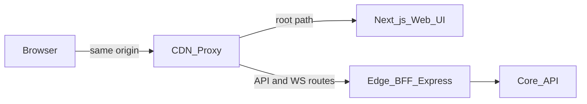
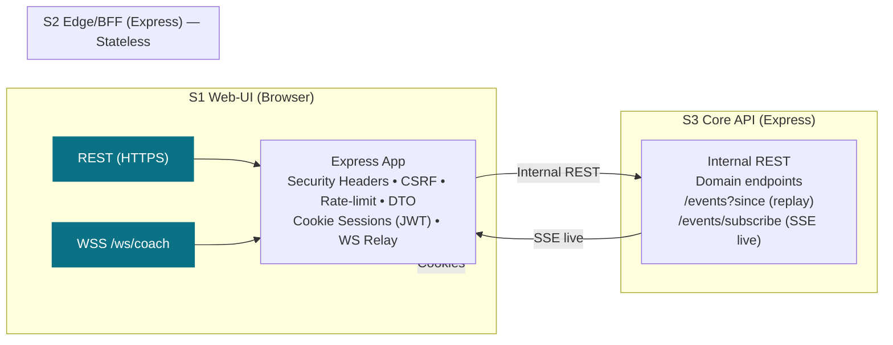
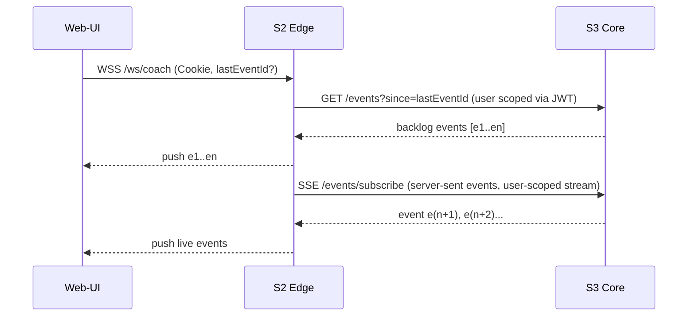
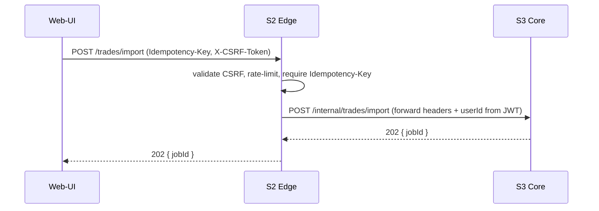

# 04 — Stack 2: Edge / BFF (Express) — Structure, Diagrams, Pseudocode

## Purpose & Responsibilities

* **Public facade** for S1 Web-UI:

  * Sessions (cookie-based), CSRF, **rate-limits**, request **DTO validation**, **idempotency header enforcement**.
  * **No database access**. Proxies business requests to **S3 Core API**.
* **Real-time relay**:

  * Manages **WSS** to browsers.
  * Subscribes to Core’s **event stream (SSE)** and fans out per user.
  * Supports client **replay** via `/events?since`.

> Design goal: keep Edge **stateless** and minimal. Security boundary + UX glue. All domain logic/data lives in S3 Core.


## Recommended setup

**separate deployables** (two services), but presented to the browser as **one origin** via routing.

* **S1 Web-UI (Next.js)** = its own service (SSR/static, assets).
* **S2 Edge/BFF (Express/Fastify)** = its own service (public REST, WebSockets, CSRF, idempotency, fan-out).

Put a proxy/CDN (e.g., Cloudflare) in front so users hit a **single domain**, and route paths:

* `/` → Next.js (S1)
* `/api/*` → Edge/BFF (S2)
* `/ws` → Edge/BFF (S2, WebSocket)

This keeps:

* **Clean separation of concerns** (UI vs. session/auth/WS logic).
* **Independent scaling** (Edge can scale on connections; Next on SSR).
* **Simpler security** (same-origin cookies; no CORS headaches).



## Alternatives (when/why)

* **Single app (embed BFF inside Next API routes)**: OK for a throwaway prototype; harder to scale WS separately later.
* **Separate subdomains (app.example.com & edge.example.com)**: Works, but you must manage CORS and cookie `Domain=.example.com`.
---

## Architecture

### Module map (Mermaid)



### Key sequences

**A) Login + session cookie (stateless JWT)**

```mermaid
sequenceDiagram
  participant UI as Web-UI
  participant E as S2 Edge
  participant C as S3 Core
  UI->>E: POST /auth/login (email,pw)
  E->>C: POST /auth/login (same)
  C-->>E: 200 { jwt, jti, exp } + set Session in DB
  E->>UI: Set-Cookie: session=JWT; HttpOnly; Secure; SameSite=Lax
```

**B) WS relay with backlog + live**



**C) Proxy business request**



---

## Public Contracts (Edge ↔ Web-UI)

* **REST (JSON)**

  * `POST /auth/signup`, `POST /auth/login`, `POST /auth/logout`, `GET /auth/me`
  * `POST /brokers/:broker/connect/start`, `GET /brokers/:broker/connect/callback`
  * `POST /trades/import` *(requires `Idempotency-Key`, `X-CSRF-Token`)*
  * `GET /trades?since&until&cursor&limit`
  * `GET /trades/:id/bias`
  * `POST /simulations/simple`
  * `GET /digests/weekly/latest`
  * `GET /rules`, `POST /rules/upsert`
  * `GET /events?since=:eventId` *(replay backlog)*

* **WSS**

  * Path: `/ws/coach`
  * Messages: `{ type, eventId, ts, v, payload }`
  * Types: `coach.reflect` | `import.progress` | `digest.ready`

> Edge **forwards** REST to Core’s internal REST and **translates** Core’s SSE stream into per-user WS pushes.

---

## Internal Contracts (Edge ↔ Core)

* **Auth**

  * `POST /internal/auth/login` → `{ jwt, exp, jti }` (JWT signed by Core; contains `sub=userId`)
  * `POST /internal/auth/signup`, `POST /internal/auth/logout`
  * `GET /internal/auth/introspect` (optional) — for revocation checks (Edge can also validate JWT offline via **JWKS**)

* **Business REST** (mirrors public paths under `/internal/...`)

  * `/internal/brokers/*`, `/internal/trades/*`, `/internal/simulations/simple`, `/internal/digests/weekly/latest`, `/internal/rules/*`
  * Headers: `X-User-Id` from JWT `sub`, `X-Request-Id`, `Idempotency-Key` (if provided)

* **Events**

  * **Replay:** `GET /internal/events?since=:eventId` (user-scoped)
  * **Live:** `GET /internal/events/subscribe` (SSE; emits `{eventId, type, ts, v, payload}` for that user context)
  * Auth: JWT in cookie forwarded as `Authorization: Bearer <jwt>` or `X-User-Id` + HMAC between Edge and Core (choose one and be consistent)

---

## Project Structure

```
apps/edge/
  src/
    server.ts
    env.ts
    logger.ts
    middlewares/
      securityHeaders.ts
      cors.ts
      rateLimit.ts
      requestId.ts
      schema.ts
      csrf.ts
      sessions.ts         # parse/verify Core-issued JWT (JWKS cache)
      userContext.ts      # add req.user
      idempotencyRequired.ts
    routes/
      auth.routes.ts
      brokers.routes.ts
      trades.routes.ts
      simulations.routes.ts
      digest.routes.ts
      rules.routes.ts
      events.routes.ts    # replay proxy
    proxy/
      coreClient.ts       # fetch wrapper -> Core
      sseSubscriber.ts    # subscribe to Core SSE live stream
    ws/
      relay.ts            # WebSocket server, per-user registry
      auth.ts             # WS handshake auth (cookie->JWT)
      fanout.ts           # push to all sockets for user
    utils/
      cookies.ts
      csrf.ts
      jwt.ts              # jwks fetch + cache, signature verify
      errors.ts
  test/
    unit/
    integration/
```

---

## Core Files — Pseudocode

### `src/server.ts`

```ts
import express from 'express';
import http from 'http';
import { registerRoutes } from './routes';
import { wsRelay } from './ws/relay';
import * as mw from './middlewares';

const app = express();
app.disable('x-powered-by');
app.use(mw.requestId());
app.use(mw.logger());
app.use(mw.securityHeaders());
app.use(mw.cors());
app.use(express.json({ limit: '1mb' }));
app.use(mw.rateLimit());
app.use(mw.sessions());       // parse JWT cookie -> req.user
app.use(mw.csrf());           // set/get CSRF token cookie + header check
app.use(mw.userContext());    // attach X-User-Id for proxies

registerRoutes(app);          // mounts /auth, /brokers, /trades, /simulations, /digests, /rules, /events

const server = http.createServer(app);
wsRelay.attach(server);       // upgrades /ws/coach

server.listen(process.env.PORT || 3000);
```

### `middlewares/sessions.ts`

```ts
// Validates Core-issued JWT from HttpOnly cookie `session`.
// Stateless: verify signature via JWKS from Core and cache keys.
export function sessions() {
  return async (req, res, next) => {
    const jwt = readCookie(req, 'session');
    if (!jwt) return next();
    try {
      const payload = await verifyJWT(jwt, await getJWKS()); // sub=userId, exp, jti
      (req as any).user = { id: payload.sub, jti: payload.jti, exp: payload.exp };
      return next();
    } catch {
      clearCookie(res, 'session');
      return res.status(401).json({ error: 'Invalid session' });
    }
  };
}
```

### `middlewares/csrf.ts`

```ts
// Double-submit: non-HttpOnly cookie 'csrf_token' + header 'X-CSRF-Token' on mutating requests
export function csrf() {
  return (req, res, next) => {
    const token = readCookie(req, 'csrf_token') || rotateAndSetNew(res);
    if (['POST','PUT','PATCH','DELETE'].includes(req.method)) {
      if (req.get('X-CSRF-Token') !== token) return res.status(403).json({ error: 'CSRF' });
    }
    next();
  };
}
```

### `middlewares/idempotencyRequired.ts`

```ts
export function idempotencyRequired() {
  return (req, res, next) => {
    if (!req.get('Idempotency-Key')) return res.status(428).json({ error: 'Idempotency-Key required' });
    next();
  };
}
```

### `proxy/coreClient.ts`

```ts
const CORE_BASE = process.env.CORE_BASE!;

export async function coreFetch(path: string, init: RequestInit & { user?: { id:string } }) {
  const headers: any = {
    'Content-Type':'application/json',
    'X-User-Id': init.user?.id,
    'X-Request-Id': (init as any).requestId,
  };
  // forward Idempotency-Key & CSRF if present
  ['Idempotency-Key','X-CSRF-Token','Authorization'].forEach(h => {
    const v = (init.headers as any)?.[h] || (init as any).req?.get?.(h);
    if (v) headers[h] = v;
  });
  const res = await fetch(`${CORE_BASE}${path}`, { ...init, headers });
  if (!res.ok) throw new Error(await res.text());
  return res;
}
```

### `proxy/sseSubscriber.ts`

```ts
// One connection per Edge instance to Core SSE: /internal/events/subscribe?stream=edge
// Receives events for all users (or per-user stream if Core scopes it)
// Fan-out to WS by userId

import EventSource from 'eventsource';
import { fanoutToUser } from '../ws/fanout';

export function startSSE() {
  const es = new EventSource(`${process.env.CORE_BASE}/internal/events/subscribe`, {
    headers: { Authorization: `Bearer ${process.env.EDGE_INTERNAL_TOKEN}` }
  });
  es.onmessage = (msg) => {
    const evt = JSON.parse(msg.data); // { userId, eventId, type, ts, v, payload }
    fanoutToUser(evt.userId, evt);
  };
  es.onerror = () => setTimeout(startSSE, 1000 + Math.random()*2000);
}
```

### `ws/relay.ts`

```ts
import { WebSocketServer } from 'ws';
import { verifyJWT } from '../utils/jwt';
import { coreFetch } from '../proxy/coreClient';

const registry = new Map<string, Set<WebSocket>>(); // userId -> sockets

function add(userId: string, ws: WebSocket) {
  if (!registry.has(userId)) registry.set(userId, new Set());
  registry.get(userId)!.add(ws);
  ws.on('close', () => registry.get(userId)!.delete(ws));
}

export const wsRelay = {
  attach(server) {
    const wss = new WebSocketServer({ noServer: true });

    server.on('upgrade', async (req, socket, head) => {
      if (req.url?.startsWith('/ws/coach') === false) return;
      // Authenticate from Cookie (session=JWT)
      const jwt = readCookieFromUpgrade(req, 'session');
      let userId: string;
      try { userId = (await verifyJWT(jwt, await getJWKS())).sub; }
      catch { socket.destroy(); return; }

      wss.handleUpgrade(req, socket, head, async (ws) => {
        add(userId, ws);

        // Backfill if lastEventId provided as query
        const lastId = new URL(req.url!, 'http://x').searchParams.get('lastEventId');
        if (lastId) {
          const res = await coreFetch(`/internal/events?since=${encodeURIComponent(lastId)}`, { method:'GET', user:{ id: userId } });
          const backlog = await res.json();
          backlog.forEach((e:any) => ws.send(JSON.stringify(e)));
        }
      });
    });
  }
};

export function fanoutToUser(userId: string, evt: any) {
  const set = registry.get(userId);
  if (!set) return;
  const payload = JSON.stringify(evt);
  for (const ws of set) {
    if (ws.readyState === ws.OPEN) ws.send(payload);
  }
}
```

### Routes (proxies)

#### `routes/auth.routes.ts`

```ts
app.post('/auth/login', schema(LoginDto), async (req,res) => {
  const r = await coreFetch('/internal/auth/login', { method:'POST', body: JSON.stringify(req.body) });
  const { jwt, exp } = await r.json();
  setSessionCookie(res, jwt, exp);
  res.json({ ok: true });
});

app.post('/auth/logout', requireUser, async (req,res) => {
  await coreFetch('/internal/auth/logout', { method:'POST', user: req.user! });
  clearSessionCookie(res);
  res.json({ ok: true });
});

app.get('/auth/me', requireUser, async (req,res) => {
  res.json({ userId: req.user!.id });
});
```

#### `routes/trades.routes.ts`

```ts
app.post('/trades/import', requireUser, idempotencyRequired(), async (req,res) => {
  const r = await coreFetch('/internal/trades/import', { method:'POST', body: JSON.stringify(req.body), user: req.user! });
  res.status(r.status).send(await r.text());
});

app.get('/trades', requireUser, async (req,res) => {
  const r = await coreFetch(`/internal/trades${req.url.includes('?')?req.url.slice(req.url.indexOf('?')):''}`, { method:'GET', user: req.user! });
  res.status(200).send(await r.text());
});
```

#### `routes/events.routes.ts` (replay)

```ts
app.get('/events', requireUser, async (req,res) => {
  const since = req.query.since as string;
  const r = await coreFetch(`/internal/events?since=${encodeURIComponent(since)}`, { method:'GET', user: req.user! });
  res.status(200).send(await r.text());
});
```

*(Brokers, simulations, digest, rules mirror this pattern; apply `requireUser`, `idempotencyRequired` on POSTs, and proxy to `/internal/...`.)*

---

## Security & Compliance at Edge

* **Stateless sessions**: JWT **issued by Core**, validated at Edge via **JWKS** (cached). Cookie: `HttpOnly; Secure; SameSite=Lax`.
* **CSRF**: **double-submit** cookie (`csrf_token`) and `X-CSRF-Token` header on mutating requests.
* **Rate limiting**: token bucket per IP + optional `X-User-Id` key; burst + refill; 429 with `Retry-After`.
* **Headers**: CSP, HSTS, Referrer-Policy, Permissions-Policy, X-Content-Type-Options.
* **Idempotency**: Edge **requires** `Idempotency-Key` on sensitive POSTs and **forwards** it; Core performs dedupe.
* **CORS**: allow only your origin(s); credentials enabled.
* **Logging**: redact cookies/authorization; include `X-Request-Id` correlation.

---

## Testing

**Unit**

* `sessions.test.ts` — JWKS cache, JWT verify, invalid clears cookie.
* `csrf.test.ts` — header/cookie mismatch → 403; rotate token.
* `rateLimit.test.ts` — 429 on burst; `Retry-After`.
* `idempotencyRequired.test.ts` — 428 when missing.

**Integration (mock Core)**

* Login flow: proxy to Core, set cookie, `GET /auth/me` returns userId.
* Trades import: POST with Idempotency-Key → 202 passthrough.
* Events replay: `GET /events?since` proxies result.

**WS Relay**

* Auth on upgrade with cookie JWT.
* Backfill using `/internal/events?since`.
* Live fanout from **SSE** subscriber to connected clients.
* Reconnect jitter, multiple sockets per user.

---

## Environment Variables

* `PORT` — Edge port
* `CORE_BASE` — Core API base URL (internal)
* `CORE_JWKS_URL` — JWKS endpoint for JWT validation (or `CORE_JWT_PUBLIC_KEY`)
* `EDGE_INTERNAL_TOKEN` — bearer for subscribing to Core SSE (if required)
* `ALLOWED_ORIGINS` — comma-sep CORS origins
* `RATE_LIMIT_RPS`, `RATE_LIMIT_BURST`
* `COOKIE_DOMAIN`, `COOKIE_SECURE=true`

> No secrets logged. Rotate `EDGE_INTERNAL_TOKEN` with deploys.

---

## Open Decisions

* **Event delivery from Core**: Edge currently uses **SSE**; Core could alternatively call a private **webhook** on Edge. Keep SSE for simplicity.
* **Rate-limit store**: In-memory for MVP or Redis-backed if multiple Edge replicas.
* **JWT revocation**: Edge validates signature offline; add optional periodic `/internal/auth/introspect` check or short JWT TTL (e.g., 15m) + refresh on activity.

