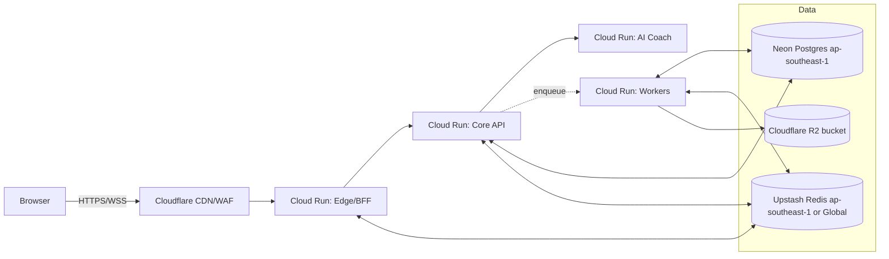

# 12B — Provider Mapping + Terraform Starter (Low-Cost, Scalable)

## Recommended combo (Asia/Singapore–centric)

* **Compute:** Google **Cloud Run** in `asia-southeast1` (Singapore). Supports WebSockets and is available in this region. ([Google Cloud][1])
* **Postgres:** **Neon** serverless Postgres in **ap-southeast-1 (Singapore)**. Has a Terraform provider and Singapore region. ([Neon][2])
* **Redis/Queues:** **Upstash Redis** (regional or global) — supports **ap-southeast-1** and global replication; Terraform provider available. ([Upstash: Serverless Data Platform][3], [Terraform Registry][4])
* **Object storage (digests/exports):** **Cloudflare R2** (low egress, S3-compatible) — data location is configurable per bucket policy. ([Cloudflare Docs][5])
* **CDN/DNS & WAF:** **Cloudflare** in front of Edge (supports WebSockets pass-through). ([Cloudflare Docs][6])

> Alt option: **Fly.io** for compute (region SIN) + Upstash (tight integration) + Neon. Use if you prefer a single app platform; confirm region at deploy time. ([fly.io][7])

---

## High-level diagram (Option B)



---

## Terraform starter (minimal, production-leaning)

> This is a **sane skeleton** you can expand. It deploys four Cloud Run services, a Neon project/DB, an Upstash Redis, and an R2 bucket. You’ll plug in real images & secrets via your CI/CD (e.g., GitHub Actions).

```
infra/
  providers.tf
  variables.tf
  main.tf
  cloudrun.tf
  redis.tf
  postgres.tf
  r2.tf
  outputs.tf
```

### `providers.tf`

```hcl
terraform {
  required_version = ">= 1.6.0"
  required_providers {
    google     = { source = "hashicorp/google", version = ">= 5.40.0" }   # v2 Cloud Run
    neon       = { source = "dotkom/neon",      version = ">= 0.9.0" }
    upstash    = { source = "upstash/upstash",   version = ">= 1.3.0" }
    cloudflare = { source = "cloudflare/cloudflare", version = ">= 4.40.0" }
  }
}

provider "google" {
  project = var.gcp_project
  region  = var.gcp_region   # asia-southeast1
}

# NEON auth via env NEON_API_KEY
provider "neon" {}

# Upstash auth via env UPSTASH_EMAIL / UPSTASH_API_KEY
provider "upstash" {}

# Cloudflare auth via env CLOUDFLARE_API_TOKEN
provider "cloudflare" {
  account_id = var.cloudflare_account_id
}
```

### `variables.tf`

```hcl
variable "gcp_project" { type = string }
variable "gcp_region"  { type = string  default = "asia-southeast1" }

variable "cloudflare_account_id" { type = string }
variable "cloudflare_zone_id"    { type = string }
variable "domain_edge"           { type = string } # e.g. app.yourdomain.com

# images (pin from your registry)
variable "image_edge"   { type = string }
variable "image_core"   { type = string }
variable "image_workers"{ type = string }
variable "image_ai"     { type = string }

# app config (non-secrets)
variable "app_env"      { type = string  default = "prod" }
```

### `main.tf` (network + IAM bits kept minimal)

```hcl
# Artifact Registry is optional if you push from another registry.
resource "google_project_service" "run"    { service = "run.googleapis.com" }
resource "google_project_service" "iam"    { service = "iam.googleapis.com" }
resource "google_project_service" "logging"{ service = "logging.googleapis.com" }

# Service account for all services (split later if needed)
resource "google_service_account" "app" {
  account_id   = "trading-coach-app"
  display_name = "Trading Coach App"
}
```

### `cloudrun.tf` (Edge, Core, Workers, AI Coach)

```hcl
# Helper: common annotations for WebSockets/timeouts/etc.
locals {
  cpu       = 1
  memory    = "512Mi"
  min_scale = 1
  max_scale = 4
  timeout   = "900s" # websockets treated as HTTP streams; keep generous (Cloud Run WS supported). 
}

resource "google_cloud_run_v2_service" "edge" {
  name     = "edge-bff"
  location = var.gcp_region
  template {
    containers {
      image = var.image_edge
      # Env injected at deploy via CI (Google Secret Manager or build-time)
      env { name = "APP_ENV" value = var.app_env }
      # Example: public URL for Core (private networking not required)
      env { name = "CORE_BASE_URL" value = google_cloud_run_v2_service.core.uri }
    }
    scaling {
      min_instance_count = 2        # HA for user-facing
      max_instance_count = 10
    }
    timeout         = local.timeout
    service_account = google_service_account.app.email
  }
  deletion_protection = false
  depends_on = [google_project_service.run]
}

resource "google_cloud_run_v2_service" "core" {
  name     = "core-api"
  location = var.gcp_region
  template {
    containers {
      image = var.image_core
      env { name = "APP_ENV" value = var.app_env }
      # DB/Redis endpoints will be injected from outputs/secrets
    }
    scaling { min_instance_count = local.min_scale max_instance_count = local.max_scale }
    timeout         = "60s"
    service_account = google_service_account.app.email
  }
}

resource "google_cloud_run_v2_service" "workers" {
  name     = "workers"
  location = var.gcp_region
  template {
    containers { image = var.image_workers env { name="APP_ENV" value=var.app_env } }
    scaling { min_instance_count = local.min_scale max_instance_count = 6 }
    timeout         = "600s"
    service_account = google_service_account.app.email
  }
}

resource "google_cloud_run_v2_service" "ai" {
  name     = "ai-coach"
  location = var.gcp_region
  template {
    containers { image = var.image_ai env { name="APP_ENV" value=var.app_env } }
    scaling { min_instance_count = local.min_scale max_instance_count = local.max_scale }
    timeout         = "5s"
    service_account = google_service_account.app.email
  }
}
```

> Notes: Cloud Run **supports WebSockets**; ensure your Edge service keeps a long enough timeout for chat streams. ([Google Cloud][8])

### `postgres.tf` (Neon in ap-southeast-1)

```hcl
# Creates a Neon project, default branch, database and role in Singapore.
resource "neon_project" "main" {
  name      = "trading-coach"
  region_id = "aws-ap-southeast-1"  # Singapore
}

resource "neon_branch" "main" {
  project_id = neon_project.main.id
  name       = "main"
}

resource "neon_database" "app" {
  project_id = neon_project.main.id
  branch_id  = neon_branch.main.id
  name       = "appdb"
}

resource "neon_role" "app" {
  project_id = neon_project.main.id
  branch_id  = neon_branch.main.id
  name       = "appuser"
  password   = random_password.db.result
}

resource "random_password" "db" { length = 24 special = true }

output "postgres_url" {
  description = "Postgres connection string"
  value       = "postgres://${neon_role.app.name}:${random_password.db.result}@${neon_branch.main.host}/${neon_database.app.name}"
  sensitive   = true
}
```

> Neon provides Singapore region `aws-ap-southeast-1` and has a Terraform provider. ([Neon][2])

### `redis.tf` (Upstash Redis in ap-southeast-1 or Global)

```hcl
resource "upstash_redis_database" "main" {
  database_name = "trading-coach-${var.app_env}"
  region        = "ap-southeast-1"  # or "global"
  multizone     = true
}

output "redis_rest_url"    { value = upstash_redis_database.main.rest_url    sensitive = true }
output "redis_rest_token"  { value = upstash_redis_database.main.rest_token  sensitive = true }
output "redis_upstash_url" { value = upstash_redis_database.main.endpoint    sensitive = true }
```

> Upstash supports **ap-southeast-1** and global replication; Terraform resources are first-class. ([Upstash: Serverless Data Platform][3], [Terraform Registry][4])

### `r2.tf` (Cloudflare R2 bucket for digests/exports)

```hcl
resource "cloudflare_r2_bucket" "digests" {
  account_id = var.cloudflare_account_id
  name       = "trading-coach-digests-${var.app_env}"
}

# (Optional) DNS for Edge custom domain; Cloud Run domain mapping can be added later.
resource "cloudflare_record" "edge" {
  zone_id = var.cloudflare_zone_id
  name    = var.domain_edge
  type    = "CNAME"
  value   = google_cloud_run_v2_service.edge.uri  # use DNS-only first; add Cloud Run domain mapping if proxying
  proxied = false
}
```

> R2’s physical data location is configurable per bucket policy; keep your region constraints in mind. ([Cloudflare Docs][5])

### `outputs.tf`

```hcl
output "edge_url"   { value = google_cloud_run_v2_service.edge.uri }
output "core_url"   { value = google_cloud_run_v2_service.core.uri }
output "ai_url"     { value = google_cloud_run_v2_service.ai.uri }
output "workers_url"{ value = google_cloud_run_v2_service.workers.uri }
```

---

## How to wire secrets into services (quick plan)

* Store **DB URL, Upstash tokens, AI HMAC secrets** in your CI/CD secret store.
* At deploy time, set Cloud Run **env vars** (or mount Google Secret Manager values) for:

  * `DATABASE_URL` ← `postgres_url` output
  * `REDIS_URL` / `REDIS_REST_URL` / `REDIS_TOKEN` ← Upstash outputs
  * `S3_ENDPOINT`, `S3_BUCKET`, `S3_ACCESS_KEY`, `S3_SECRET_KEY` ← R2 access keys
  * `AI_HMAC_KEY_ID`, `AI_HMAC_SECRET` for AI Coach signing
* For **Edge cookies & CSRF pepper**, use runtime secrets only (never in VCS).

---

## Cost & scale posture (rules of thumb)

* Start with **min instances**: Edge=2 (HA), Core/AI/Workers=1; autoscale up on CPU/latency/queue depth.
* Neon & Upstash **free/low tiers** often cover MVP loads; upgrade as DAU grows. ([Neon][9], [Upstash: Serverless Data Platform][10])
* Keep R2 for **egress-friendly** object storage; push archives >30d to colder classes (lifecycle rule). ([Cloudflare Docs][5])
* WebSockets on Cloud Run are supported; mind the **request timeout** and connection counts when you scale. ([Google Cloud][8])

---

## Deploy steps (one-time)

1. **Create** GCP project; enable Cloud Run API.
2. Export provider creds locally or in CI: `GOOGLE_APPLICATION_CREDENTIALS`, `NEON_API_KEY`, `UPSTASH_API_KEY/EMAIL`, `CLOUDFLARE_API_TOKEN`.
3. `terraform init && terraform apply -var gcp_project=... -var cloudflare_account_id=... -var cloudflare_zone_id=... -var domain_edge=app.example.com -var image_*=...`
4. Pipe `outputs` to your deploy job and set **Cloud Run env vars** accordingly.
5. (Optional) Add **Cloud Run Domain Mapping** and switch Cloudflare record to **proxied** once TLS is live.

---

## Notes & gotchas

* If you later **IP-allowlist** Neon, you’ll need a **static egress IP** from Cloud Run (Serverless VPC + Cloud NAT) or host Core in the same provider. Keep Neon open over TLS with strong creds for MVP; tighten later.
* Cloud Run **WebSockets** are fine for MVP; if you plan tens of thousands of concurrent sockets, consider a dedicated WS fanout tier or Cloudflare Workers Durable Objects later. ([Google Cloud][8], [Cloudflare Docs][11])
