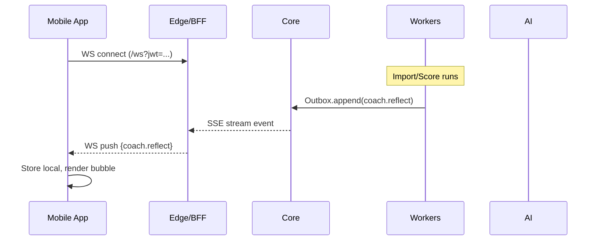
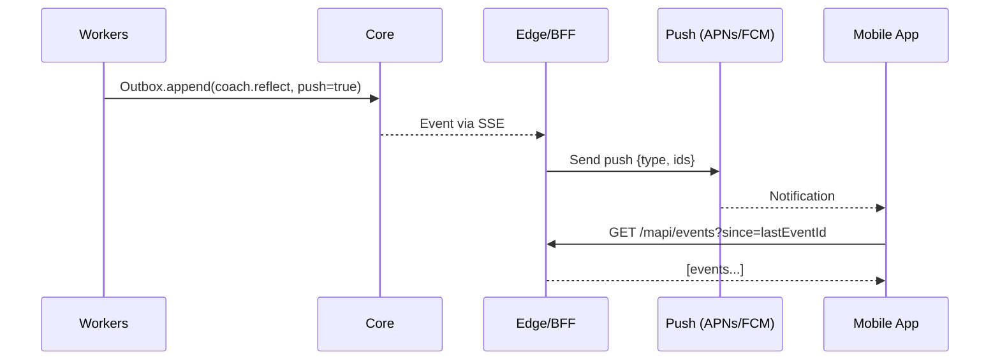

The **mobile app is just another client** alongside the Web-UI, but it plugs into the *same* Edge/BFF (S2) and everything downstream (Core, Workers, AI). Think of it as a different shell over the same brain.

# How mobile fits

```mermaid
flowchart LR
  subgraph Mobile
    RN[Mobile App (iOS/Android)]
  end
  subgraph Web
    NX[Web-UI (Next.js)]
  end
  subgraph Edge
    S2[Edge/BFF (REST + WS)]
  end
  subgraph Backend
    S3[Core API]
    S4[Workers]
    S5[AI Coach]
    PG[(Postgres)]
    R[(Redis)]
    S3O[(S3/R2)]
  end

  RN -->|HTTPS/WS| S2
  NX -->|HTTPS/WS| S2
  S2 --> S3
  S3 --> PG
  S3 <--> R
  S3 --> S5
  S3 --> S4
  S4 --> PG
  S4 --> S3O
```

## Design principles

* **One backend, multiple clients.** Mobile and web talk to the same S2 endpoints & WS channel.
* **Same contracts.** Reuse DTOs/Zod schemas across web & mobile for true contract parity.
* **No CORS drama.** Mobile uses token headers (not browser cookies), so CSRF isn’t in play.

---

# Mobile-specific choices

## 1) Auth & session model

* **Mobile uses OAuth2 PKCE** (or email+pass) to obtain **short-lived access JWT** + **refresh token**.
* Store tokens in **Secure Enclave/Keychain (iOS)** / **Android Keystore**.
* **Do not use cookies** on native; send `Authorization: Bearer <JWT>` per request.
* Add to S2:

  * `POST /mapi/auth/login` → `{ access_jwt, refresh_token, exp }`
  * `POST /mapi/auth/refresh` → rotates access JWT (and optionally refresh)
  * `POST /mapi/auth/logout` → server-side revoke + wipe local
* **CSRF not required** on mobile (no cookies), but still use **Idempotency-Key** on mutating calls.

## 2) Real-time updates

* Foreground: **WebSocket** to S2 `/ws?jwt=...` (same events as web).
* Background / app killed: **push notifications** (APNs/FCM) for important event types:

  * `import.progress` (optional), `coach.reflect`, `digest.ready`
* S2 adds a **Push Fanout** hook (or emits to a tiny push service) when writing Outbox rows with “push-worthy” tags.

## 3) Broker connect (mobile OAuth)

Two secure patterns; pick one:

**A. AppAuth PKCE (preferred native flow)**

1. App calls `POST /mapi/brokers/:b/start` → returns `{ authorize_url, state, code_verifier }`
2. App opens **ASWebAuthenticationSession / Chrome Custom Tabs** to broker.
3. Broker redirects to **app’s universal link** (`https://app.example.com/oauth/native`) which wakes the app.
4. App posts `{ code, state, code_verifier }` to `POST /mapi/brokers/:b/complete`.
5. S2 → S3 exchanges code server-side, seals tokens, audits success.

**B. Server callback + app polling**

* Broker redirects to server URL; S2/S3 finishes OAuth and marks a **one-time token** ready.
* App polls `GET /mapi/brokers/:b/status?tx=...` until linked.

> We already designed token sealing in Core; mobile flow just changes where the code lands.

## 4) Offline & sync

* Mobile keeps a small local DB (SQLite/Room/Realm) for **trades, bias tags, digests**.
* On resume or reconnect:

  * Call `GET /api/events?since=<lastEventId>` to **replay** missed events.
  * Upsert local state; set new `lastEventId`.
* This reuses the same **Event Outbox** we built — no new backend needed.

## 5) API surface (mobile)

Use the same endpoints as web, just scoped under `/mapi/*` (or reuse `/api/*` if you prefer). Examples:

* `POST /mapi/trades/import` (Idempotency-Key)
* `GET /mapi/trades?cursor=...`
* `GET /mapi/trades/:id/bias`
* `POST /mapi/simulations/simple`
* `GET /mapi/digests/weekly/latest`
* `GET /mapi/events?since=...`
* `WS /ws` (JWT in query or `Sec-WebSocket-Protocol`)

> Same request/response shapes as web; we keep one contract.

## 6) Security on mobile

* **Secure storage**: Keychain/Keystore (no plaintext).
* **TLS** everywhere; optional **cert pinning** in HTTP client.
* **Refresh discipline**: auto-refresh access tokens when ≤ 2 min to expiry.
* **No secrets in push payloads**; push only minimal metadata/ids.
* **Device posture**: consider jailbreak/root detection (optional).

## 7) Error handling & resilience

* Implement **backoff + jitter** for retries.
* WS: auto-reconnect with **resume**: on connect, send `since=<lastEventId>` to receive a small replay.
* Rate limits: honor 429 with Retry-After.

---

# Implementation outline

## Client stack

* **React Native** (Expo bare or CLI) or **Flutter**.
* HTTP: `fetch`/axios with interceptors for JWT refresh + Idempotency-Key per write.
* WS: native WebSocket; heartbeat + exponential backoff.
* Local DB: SQLite (RN-SQLite/WatermelonDB) or Room/Realm (Flutter alternatives exist).
* Push: FCM + APNs (through Firebase or OneSignal).

## Code sharing

Monorepo packages:

* `packages/contracts` — **Zod schemas & TS types** reused across S1/S2/mobile.
* `packages/shared-logic` — helpers for event normalization, idempotency, date math.
* `packages/ui-tokens` — colors/spacing/typography shared (if RN).

---

# Minimal delta in backend

What we add to existing stacks to support mobile:

**S2 Edge/BFF**

* `/mapi/auth/*` routes (JWT + refresh token flow).
* `/mapi/brokers/:b/start|complete|status` (mobile PKCE/OAuth).
* WS auth via header or query token; **push fanout** hook (to APNs/FCM) for select events.
* Same DTO validators as web.

**S3 Core**

* No change to domain logic.
* Optional: endpoint to mint/rotate **refresh tokens** & maintain token blacklist/rotation table.

**S4 Workers / S5 AI**

* No change.

---

# Example sequences

## Foreground reflect (mobile)



## Background reflect (push)



---

# Practical next steps

1. **Decide client tech** (React Native vs Flutter).
2. **Add S2 mobile routes** for auth/PKCE and WS JWT auth.
3. **Implement push** fanout (S2 → APNs/FCM) for `digest.ready` and high-value `coach.reflect`.
4. **Ship a thin mobile MVP**:

   * Login, connect broker, import, live reflect bubble, weekly digest card.
   * Local cache + replay on resume.
5. **Harden**: token rotation, cert pinning, crash + analytics, OTA updates (CodePush/Expo EAS or Flutter alternatives).

---
