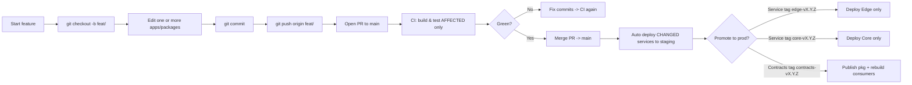
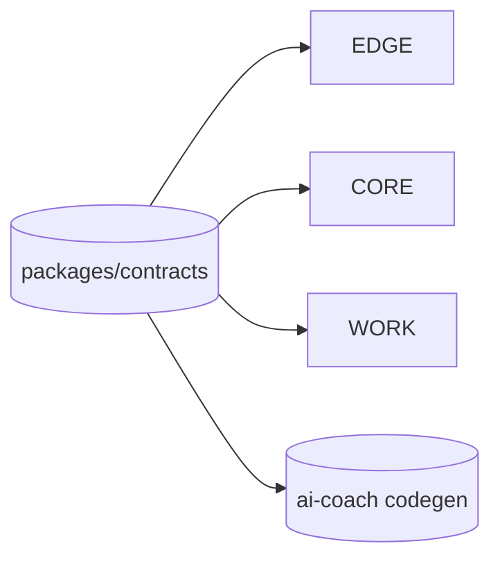
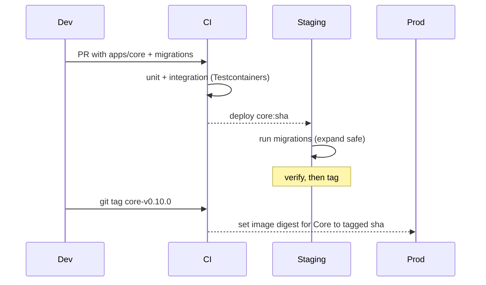

# Monorepo Dev Flow w/ Turbo or Nx

## What are Turbo & Nx?

Both are **monorepo build systems**. They:

* build a **dependency graph** of your packages/apps,
* run tasks **only for projects affected** by a change,
* cache outputs (local + remote) to **speed up CI**,
* give you `run build/test/lint` across the whole repo with smart filtering.

**Pick one (either works):**

| Feature                                     | Turborepo | Nx                        |
| ------------------------------------------- | --------- | ------------------------- |
| Task runner & affected graph                | ✅         | ✅                         |
| Remote cache (free OSS server or self-host) | ✅         | ✅                         |
| Generators/Scaffolding                      | light     | rich                      |
| DX & config verbosity                       | minimal   | more features, more knobs |

For our stack, **Turbo is enough** (simple and fast). If you want generators and more, choose **Nx**.

---

## Repo layout (recap)

```
.
├─ apps/
│  ├─ web/         # S1 Web-UI (Next.js)
│  ├─ edge/        # S2 Edge/BFF (Express/Fastify)
│  ├─ core/        # S3 Core API (Node)
│  ├─ workers/     # S4 Workers (Node)
│  └─ ai-coach/    # S5 AI Coach (Python; built separately)
├─ packages/
│  └─ contracts/   # Zod DTOs (source of truth)
├─ pnpm-workspace.yaml
├─ turbo.json      # or nx.json + project.json (if Nx)
└─ infra/          # Terraform
```

---

## High-level dev → release flow



* **Staging** always deploys **only services that changed** in that PR.
* **Prod** deploys by **service tags** (`edge-v1.4.0`, `core-v0.9.2`, …), reusing the **same image digest** built on main.

---

## How “affected only” works

### Turborepo config (example)

`turbo.json`

```json
{
  "pipeline": {
    "build": {
      "dependsOn": ["^build"],
      "outputs": ["dist/**", "build/**"]
    },
    "test": {
      "dependsOn": ["build"]
    },
    "docker": {
      "dependsOn": ["build"],
      "cache": false
    }
  }
}
```

Run on PR:

```bash
# Only run tasks for projects changed since main
pnpm turbo run build test --filter=...[HEAD~0] --since=origin/main
# Or simpler:
pnpm turbo run build test --since=origin/main
```

Turbo figures out the graph (e.g., if `packages/contracts` changed, it **marks dependents** `apps/edge`, `apps/core`, `apps/workers` as affected too).

> **Nx** equivalent: `nx affected --target=build --base=origin/main --head=HEAD`

---

## Three common scenarios (with diagrams)

### 1) UI-only change (S1 Web)

* You edit `apps/web` only.
* CI builds/tests **web only**.
* Staging deploys **web** image only.
* No tags needed; prod deploy later when you’re ready.

```mermaid
flowchart LR
  subgraph Affected
    WEB[(apps/web)]
  end
  subgraph Unchanged
    EDGE[(apps/edge)] CORE[(apps/core)] WORK[(apps/workers)]
  end
  WEB -- build/test/deploy --> Staging
```

**Commands**

```bash
git checkout -b feat/web-copy-tweak
# edit apps/web/*
git commit -m "web: tweak copy on dashboard"
git push origin feat/web-copy-tweak
# open PR -> CI builds web only -> merge -> staging updates web
# later: tag if you want a prod cut via your release cadence
```

---

### 2) Contracts change (shared DTOs)

* You change `packages/contracts` (e.g., add optional field).
* Turbo marks **edge, core, workers** as affected (consumers).
* CI:

  * builds `contracts`,
  * runs consumer tests (Edge/Core/Workers),
  * generates JSON Schema → Pydantic for AI (codegen check).
* Staging deploys Edge/Core/Workers that changed.
* For prod:

  * tag library: `contracts-v0.2.5` (semver),
  * tag services you want to release now (e.g., `core-v0.9.3`).



**Commands**

```bash
git checkout -b feat/contracts-add-field
# edit packages/contracts/src/*
pnpm -w --filter @tc/contracts build gen:schemas
# (optional) run ai codegen locally
pnpm --filter ./apps/ai-coach exec python gen_models.py
git commit -m "contracts: add optional field X"
git push && open PR
# merge -> staging redeploys Edge/Core/Workers (and passes AI codegen check)
# prod when ready:
git tag contracts-v0.2.5 && git push --tags
git tag core-v0.9.3 && git push --tags
```

---

### 3) Core + DB migration

* You change `apps/core` + migration files.
* CI builds/tests **core**; integration tests spin Postgres via Testcontainers.
* Staging auto-deploys **core**; runs migration in `prisma migrate deploy` (or SQL).
* After validation, **tag** to cut prod.



---

## Branching & tagging conventions

* **Branches**: `feat/*`, `fix/*`, `chore/*`.
* **Main** is always **deployable**; merges go to **staging** automatically.
* **Service tags (prod)**:

  * `edge-v1.4.0`, `core-v0.9.3`, `workers-v0.6.1`, `ai-v0.3.0`
* **Library tags (publish)**:

  * `contracts-v0.2.5` (Changesets can automate).

**Create tags**

```bash
git tag edge-v1.4.0
git push origin edge-v1.4.0
```

Your deploy workflow listens to **service-specific tag patterns** and updates **only that service** in prod to the image built from the merged commit.

---

## CI: build & deploy only what changed (pseudo steps)

1. Checkout repo.
2. Detect affected graph:

   * Turbo: `pnpm turbo run build test --since=origin/main`
3. For each affected **app**:

   * Build Docker image `:git-sha`
   * Push image to registry
4. **Staging deploy**:

   * Terraform/CLI updates **only** those Cloud Run services to `image:sha`.
5. **Prod deploy**:

   * On tag `edge-v*`: set Edge image to the **already built sha** (no rebuild).
   * On tag `core-v*`: same for Core, etc.

---

## Minimal Turbo + pnpm wiring

`pnpm-workspace.yaml`

```yaml
packages:
  - "apps/*"
  - "packages/*"
```

`package.json` (root scripts)

```json
{
  "scripts": {
    "build": "turbo run build",
    "test": "turbo run test",
    "affected": "turbo run build test --since=origin/main"
  },
  "devDependencies": { "turbo": "^2.0.0", "pnpm": "^9" }
}
```

Each app has its own `package.json` with `build`/`test` scripts. Docker builds use the app dir as context.

---

## Cheat sheet

* **Add UI feature** → PR → only **web** builds → staging updates **web**.
* **Change contracts** → PR → rebuild **contracts** + **edge/core/workers** → staging updates those; **tag** `contracts-vX.Y.Z` to publish; **tag** services to go prod.
* **API change** → PR in **core** (+ migrations if needed) → staging → **tag `core-vX.Y.Z`** for prod.
* **Hotfix Edge only** → PR in `apps/edge` → staging → **tag `edge-vX.Y.Z`**.

---

## If you prefer Nx

Replace Turbo commands with Nx:

```bash
# affected build/test since main
nx affected --target=build --base=origin/main --head=HEAD
nx affected --target=test  --base=origin/main --head=HEAD
```

Nx also supports docker targets via `project.json`. The git/tag strategy stays the same.

---
