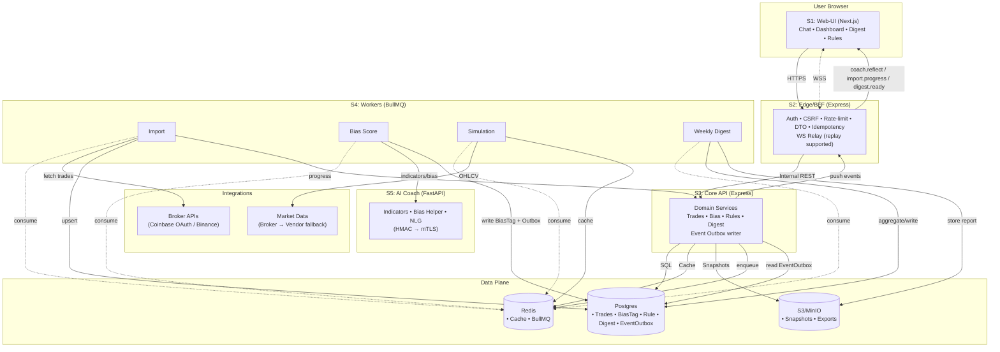

# 01 — High-Level Development Plan 

## Stacks & Responsibilities

**S1 — Web-UI (Next.js)**

* Chat (coach reflections), Dashboard, Digest, Rules/Settings.
* Manages **session cookies only**; no direct DB access.
* Opens a **WSS** to S2 for events: `coach.reflect`, `import.progress`, `digest.ready`.

**S2 — Edge / BFF (Express)**

* Public **facade**: sessions, CSRF, rate-limits, DTO validation, **idempotency**.
* **No DB** access; proxies to S3 via **internal REST**.
* Hosts **WS relay** with replay (`/events?since=…`).

**S3 — Core API (Express)**

* Owns **business logic & data** (Postgres/Redis/S3).
* Exposes internal REST to S2; writes **Event Outbox**.
* Enqueues background jobs.

**S4 — Workers (BullMQ, Node)**

* Jobs: `import.trades`, `score.bias`, `simulate.simple`, `digest.weekly`.
* Read/write Postgres/Redis/S3; append **Event Outbox** rows.

**S5 — AI Coach (FastAPI, Python)**

* Indicators, heuristic bias helper, short NLG reflection.
* **HMAC-signed** requests now; **mTLS** later.

**Data Plane**

* **Postgres** (Prisma): domains + `event_outbox` (monthly partitions).
* **Redis**: cache + BullMQ queues.
* **S3/MinIO**: OHLCV snapshots (reproducibility), exports.

**Integrations**

* **Broker APIs**: Coinbase OAuth (primary), Binance API-key (flag).
* **Market Data**: broker first → vendor fallback (flag).

## System Flow (Mermaid)

## Interfaces (Stable Contracts)

**S1 ↔ S2 (public REST/WSS)**

* REST: `/auth/*`, `/brokers/*`, `/trades/*`, `/simulations/simple`, `/digests/weekly/latest`, `/rules/*`, `/events?since=…`
* WSS: `/ws/coach` → events `{ type, eventId, ts, v, payload }` (resume with `lastEventId`)

**S2 ↔ S3 (internal REST)**

* Mirrors public routes (no session mgmt); S2 forwards `userId` context.

**S3 ↔ S4 (queues)**

* `q_import`, `q_score`, `q_sim`, `q_digest` (deterministic `jobId`, retries, DLQ).

**S3/S4 ↔ S5 (HTTP)**

* `POST /v1/indicators`, `/v1/bias/score`, `/v1/nlg/reflect` with **HMAC** headers.

## Delivery Sequence (Thin Vertical Slices)

1. Security base (S2 auth/session/CSRF/headers) + S1 shell
2. Coinbase connect (OAuth via S2 → S3; audit)
3. Import 30d (S1 → S2 → S3 enqueue → S4 import + `import.progress`)
4. Bias tags + reflections (S4 score → outbox → S2 WSS → S1 chat)
5. Simulations (S1 CTA → S2 → S3/S4; Redis cache)
6. Weekly digest (S4 cron → outbox → S1 digest)
7. Rules & streaks (settings + evaluation)
8. Export/Delete + privacy copy
9. Perf/observability polish + SLO checks

## Quality Gates (CI)

* Unit + contract tests on PR; full integration/E2E on main.
* SAST (CodeQL), dependency/image scans (Trivy).
* Block deploy if: headers missing, SLO probes red, or “Must” E2E fail.

---

