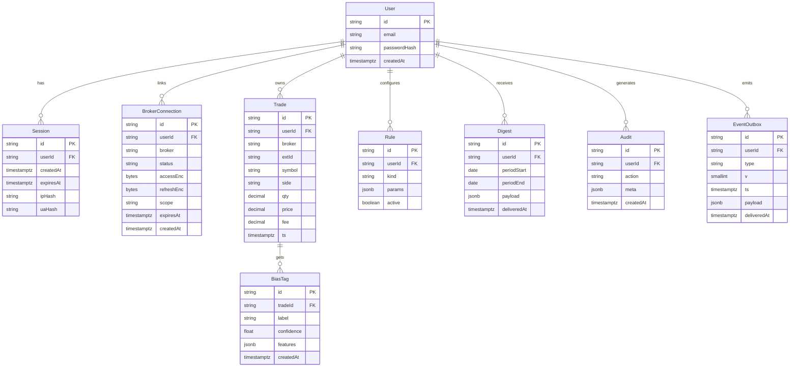

# 01 — High-Level Development Plan 

## Stacks & Responsibilities

**S1 — Web-UI (Next.js)**

* Chat (coach reflections), Dashboard, Digest, Rules/Settings.
* Manages **session cookies only**; no direct DB access.
* Opens a **WSS** to S2 for events: `coach.reflect`, `import.progress`, `digest.ready`.

**S2 — Edge / BFF (Express)**

* Public **facade**: sessions, CSRF, rate-limits, DTO validation, **idempotency**.
* **No DB** access; proxies to S3 via **internal REST**.
* Hosts **WS relay** with replay (`/events?since=…`).

**S3 — Core API (Express)**

* Owns **business logic & data** (Postgres/Redis/S3).
* Exposes internal REST to S2; writes **Event Outbox**.
* Enqueues background jobs.

**S4 — Workers (BullMQ, Node)**

* Jobs: `import.trades`, `score.bias`, `simulate.simple`, `digest.weekly`.
* Read/write Postgres/Redis/S3; append **Event Outbox** rows.

**S5 — AI Coach (FastAPI, Python)**

* Indicators, heuristic bias helper, short NLG reflection.
* **HMAC-signed** requests now; **mTLS** later.

**Data Plane**

* **Postgres** (Prisma): domains + `event_outbox` (monthly partitions).
* **Redis**: cache + BullMQ queues.
* **S3/MinIO**: OHLCV snapshots (reproducibility), exports.

**Integrations**

* **Broker APIs**: Coinbase OAuth (primary), Binance API-key (flag).
* **Market Data**: broker first → vendor fallback (flag).

## System Flow (Mermaid)

## Interfaces (Stable Contracts)

**S1 ↔ S2 (public REST/WSS)**

* REST: `/auth/*`, `/brokers/*`, `/trades/*`, `/simulations/simple`, `/digests/weekly/latest`, `/rules/*`, `/events?since=…`
* WSS: `/ws/coach` → events `{ type, eventId, ts, v, payload }` (resume with `lastEventId`)

**S2 ↔ S3 (internal REST)**

* Mirrors public routes (no session mgmt); S2 forwards `userId` context.

**S3 ↔ S4 (queues)**

* `q_import`, `q_score`, `q_sim`, `q_digest` (deterministic `jobId`, retries, DLQ).

**S3/S4 ↔ S5 (HTTP)**

* `POST /v1/indicators`, `/v1/bias/score`, `/v1/nlg/reflect` with **HMAC** headers.

## Delivery Sequence (Thin Vertical Slices)

1. Security base (S2 auth/session/CSRF/headers) + S1 shell
2. Coinbase connect (OAuth via S2 → S3; audit)
3. Import 30d (S1 → S2 → S3 enqueue → S4 import + `import.progress`)
4. Bias tags + reflections (S4 score → outbox → S2 WSS → S1 chat)
5. Simulations (S1 CTA → S2 → S3/S4; Redis cache)
6. Weekly digest (S4 cron → outbox → S1 digest)
7. Rules & streaks (settings + evaluation)
8. Export/Delete + privacy copy
9. Perf/observability polish + SLO checks

## Quality Gates (CI)

* Unit + contract tests on PR; full integration/E2E on main.
* SAST (CodeQL), dependency/image scans (Trivy).
* Block deploy if: headers missing, SLO probes red, or “Must” E2E fail.

---

# 02 — Data & ERD (Canonical Entities + Constraints)

> Field names are **authoritative** across S1–S5. Keep identical in DTOs/ORM.

## Entities

**User**

* `id` (cuid, PK)
* `email` (unique)
* `passwordHash` (Argon2id)
* `createdAt` (timestamptz)

**Session**

* `id` (cuid, PK)
* `userId` (FK → User)
* `createdAt`, `expiresAt` (timestamptz)
* `ipHash` (sha256(IP+pepper)), `uaHash` (nullable)

**BrokerConnection**

* `id` (cuid, PK), `userId` (FK → User)
* `broker` (`coinbase` | `binance` | …)
* `status` (`active`|`paused`|`revoked`)
* `accessEnc` (bytes, AES-GCM), `refreshEnc` (bytes, nullable)
* `scope` (string), `expiresAt` (nullable), `createdAt`

**Trade**

* `id` (cuid, PK), `userId` (FK → User)
* `broker` (string), `extId` (broker trade id)
* `symbol` (string), `side` (`BUY`|`SELL`)
* `qty` (decimal), `price` (decimal), `fee` (decimal, nullable)
* `ts` (timestamptz)
* **Constraint**: `UNIQUE (userId, broker, extId)`

**BiasTag**

* `id` (cuid, PK), `tradeId` (FK → Trade)
* `label` (`FOMO`|`PANIC`|`DISCIPLINE`|…)
* `confidence` (float 0..1)
* `features` (jsonb; compact feature summary)
* `createdAt` (timestamptz)

**Rule**

* `id` (cuid, PK), `userId` (FK → User)
* `kind` (e.g., `avoidSpikeOverPct`)
* `params` (jsonb; e.g., `{ pct: 10, lookbackHours: 24 }`)
* `active` (boolean, default true)

**Digest**

* `id` (cuid, PK), `userId` (FK → User)
* `periodStart` (date), `periodEnd` (date)
* `payload` (jsonb; counts by bias, P/L attribution, streaks, suggestion)
* `deliveredAt` (timestamptz, nullable)

**Audit**

* `id` (cuid, PK), `userId` (FK → User)
* `action` (`login`, `broker_linked`, `import_start`, `import_done`, …)
* `meta` (jsonb), `createdAt` (timestamptz)

**EventOutbox**

* `id` (ULID, PK), `userId` (FK → User)
* `type` (`coach.reflect` | `import.progress` | `digest.ready`)
* `v` (smallint, schema version)
* `ts` (timestamptz; **monthly partition key**)
* `payload` (jsonb)
* `deliveredAt` (timestamptz, nullable)

## ERD (Mermaid)

## Indices & Constraints

* `Trade UNIQUE(userId, broker, extId)`
* Indexes:

  * `Trade(userId, ts)`, `Trade(symbol)`
  * `BiasTag(tradeId)`
  * `Digest(userId, periodEnd)`
  * `EventOutbox(userId, ts)` (monthly partitions on `ts`)

## Data Lifecycle

* **Tokens:** `accessEnc`/`refreshEnc` sealed with AES-GCM (per-tenant DEK; KEK via KMS).
* **Events:** `EventOutbox` retained 90 days; monthly partitions pruned.
* **Digests:** keep 6 months in Postgres; older archived to S3 as JSON.
* **Exports:** generated to S3; signed URL with short TTL.
* **Deletion:** hard-delete tokens & sessions; (optional) soft-delete trades if adopted and stated in privacy copy.

## Field Sensitivity

| Entity.Field           | Sensitivity  | Notes                                       |
| ---------------------- | ------------ | ------------------------------------------- |
| User.email             | PII          | Never exposed publicly; hash in logs        |
| BrokerConnection.\*Enc | Secret       | AES-GCM sealed; never logged                |
| Session.ipHash/uaHash  | Pseudonymous | Derived; raw IP/UA not stored               |
| Trade.price/qty/fee    | Financial    | Needed for analytics; export/delete covered |
| BiasTag.features       | Low          | Keep compact; no PII                        |
| EventOutbox.payload    | Low/Med      | Avoid tokens/PII                            |

---

If you want any naming/field tweaks, tell me and I’ll adjust before we dive into the per-stack docs.
