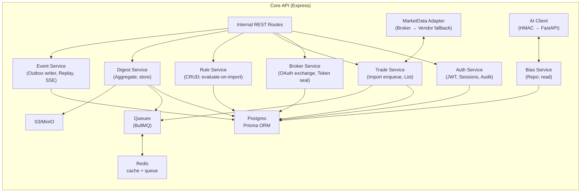
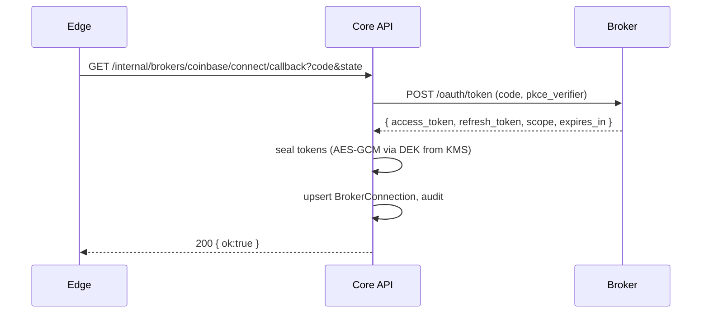
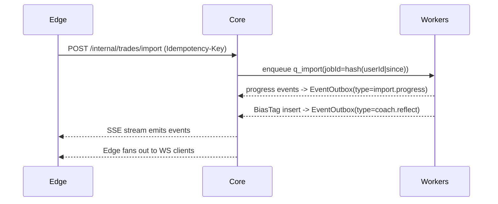
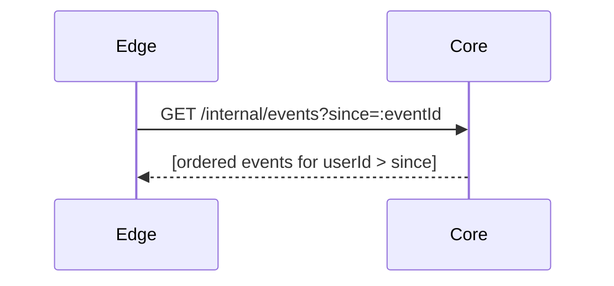

# 05 — Stack 3: Core API (Express) — Structure, DB, Diagrams, Pseudocode

## Purpose & Responsibilities

* **Owns business logic & data** (Postgres/Redis/S3) for all domains:

  * Auth (issue JWT to Edge), Broker Connections, Trades, Bias Tags, Rules, Digests, Event Outbox.
* **Internal REST** surface used **only** by S2 Edge (never exposed directly to browser).
* **Writes user events** to `EventOutbox` and provides:

  * `GET /internal/events?since` (replay)
  * `GET /internal/events/subscribe` (SSE live stream)
* **Queues jobs** (BullMQ): `q_import`, `q_score`, `q_sim`, `q_digest`.
* **Calls S5 AI Coach** with **HMAC-signed** requests (mTLS later).

> Design: one focused service with clear domain modules, idempotent writes, and an auditable event log. No WebSocket here (that’s Edge).

---

## Architecture (Mermaid)

### Module Map



### Key Sequences

**A) OAuth callback → store sealed tokens**



**B) Import → score → reflect (events)**



**C) Replay (backfill)**



---

## Data Design (ties to “02 — Data & ERD”)

Core uses the **canonical entities**:

* `User`, `Session`, `BrokerConnection`, `Trade`, `BiasTag`, `Rule`, `Digest`, `Audit`, `EventOutbox`.

**Important constraints**

* `Trade UNIQUE(userId, broker, extId)`
* `EventOutbox` monthly partitions on `ts` for retention and speed.
* Tokens (`accessEnc`, `refreshEnc`) are **AES-GCM sealed** with per-tenant DEKs; KEKs via KMS.

---

## Internal REST Surface (Edge → Core)

| Method | Path                                         | Purpose                                    |
| ------ | -------------------------------------------- | ------------------------------------------ |
| POST   | `/internal/auth/signup`                      | Create user, issue JWT, record session     |
| POST   | `/internal/auth/login`                       | Verify password, issue JWT, record session |
| POST   | `/internal/auth/logout`                      | Invalidate session (audit)                 |
| GET    | `/internal/auth/jwks.json`                   | JWKS for Edge JWT verification (public)    |
| POST   | `/internal/brokers/:broker/connect/callback` | Exchange code → tokens, seal & store       |
| POST   | `/internal/trades/import`                    | Enqueue import job (idempotent)            |
| GET    | `/internal/trades`                           | List trades (cursor)                       |
| GET    | `/internal/trades/:id/bias`                  | Bias tags for a trade                      |
| POST   | `/internal/simulations/simple`               | Compute/retrieve simple what-if (cached)   |
| GET    | `/internal/digests/weekly/latest`            | Latest digest for user                     |
| GET    | `/internal/rules`                            | List rules                                 |
| POST   | `/internal/rules/upsert`                     | Upsert rule by kind                        |
| GET    | `/internal/events`                           | Replay events since `eventId`              |
| GET    | `/internal/events/subscribe`                 | **SSE live** events for Edge               |

**Auth model**

* Edge forwards `Authorization: Bearer <JWT>` or `X-User-Id`. Prefer **JWT** with Core’s public JWKS verification at Edge; Core always validates JWT on each call.

---

## Project Structure

```
apps/core/
  src/
    server.ts
    env.ts
    logger.ts
    http/
      app.ts
      middlewares/
        authJwt.ts          # verify JWT, add req.user
        rateLimit.ts
        schema.ts           # zod validation
        requestId.ts
        securityHeaders.ts
      routes/
        auth.routes.ts
        brokers.routes.ts
        trades.routes.ts
        simulations.routes.ts
        digest.routes.ts
        rules.routes.ts
        events.routes.ts    # replay + SSE
    domain/
      auth/
        AuthService.ts
        SessionRepo.ts
        UserRepo.ts
        Jwt.ts              # sign, jwks
        AuditRepo.ts
      brokers/
        BrokerService.ts
        adapters/
          coinbase.adapter.ts
          binance.adapter.ts
      trades/
        TradeRepo.ts
        TradeService.ts
      biases/
        BiasRepo.ts
      rules/
        RuleRepo.ts
        RuleService.ts
      digest/
        DigestRepo.ts
        DigestService.ts
      events/
        OutboxRepo.ts
        EventService.ts     # append, replay, SSE
      market/
        MarketData.ts       # broker→vendor fallback
      ai/
        AiClient.ts         # HMAC client to FastAPI
    infra/
      prisma.ts             # Prisma client
      redis.ts              # Redis connection
      queues.ts             # BullMQ queues
      kms/
        keyring.ts          # KMS unwrap DEK
        tokenSeal.ts        # AES-GCM seal/open
    tests/
      unit/
      integration/
```

---

## Core Files — Pseudocode (granular)

### `src/server.ts`

```ts
import http from 'http';
import { buildApp } from './http/app';
import { startQueues } from './infra/queues';

const app = buildApp();
const server = http.createServer(app);

// start queues/workers in separate process; here only producers needed
startQueues({ producerOnly: true });

server.listen(process.env.PORT || 4001);
```

### `http/app.ts`

```ts
export function buildApp() {
  const app = express();
  app.disable('x-powered-by');
  app.use(requestId());
  app.use(logger());
  app.use(securityHeaders());
  app.use(express.json({ limit: '1mb' }));
  app.use(rateLimit());

  // public JWKS for Edge
  app.get('/internal/auth/jwks.json', (req,res) => res.json(Jwt.jwks()));

  // all other routes require JWT
  app.use(authJwt());

  // mount routes
  app.use('/internal/auth', authRoutes);
  app.use('/internal/brokers', brokerRoutes);
  app.use('/internal/trades', tradeRoutes);
  app.use('/internal/simulations', simRoutes);
  app.use('/internal/digests', digestRoutes);
  app.use('/internal/rules', ruleRoutes);
  app.use('/internal/events', eventRoutes);

  // error handler...
  return app;
}
```

### Auth (issue JWT; store session; audit)

#### `domain/auth/Jwt.ts`

```ts
import { SignJWT, exportJWK } from 'jose';
const privateKey = /* loaded at boot, rotated via KMS/secret */;

export async function sign(userId: string, jti: string, ttlSec: number) {
  return await new SignJWT({ sub: userId, jti })
    .setProtectedHeader({ alg: 'RS256', kid: process.env.JWT_KID })
    .setIssuedAt()
    .setExpirationTime(`${ttlSec}s`)
    .sign(privateKey);
}

export function jwks() { return { keys: [ exportJWK(privateKey).then(k => ({ ...k, kid: process.env.JWT_KID })) ] }; }
```

#### `http/routes/auth.routes.ts`

```ts
app.post('/login', schema(LoginDto), async (req,res) => {
  const user = await AuthService.verify(req.body.email, req.body.password);
  const jti = crypto.randomUUID();
  const jwt = await Jwt.sign(user.id, jti, 15*60);    // 15m
  await SessionRepo.create({ userId: user.id, jti, exp: addMinutes(new Date(), 15) });
  await AuditRepo.log(user.id, 'login', { ip: hashIp(req), ua: hashUa(req) });
  res.json({ jwt, exp: Date.now() + 15*60*1000 });
});

app.post('/logout', async (req,res) => {
  await SessionRepo.invalidate(req.user.id, req.user.jti);
  await AuditRepo.log(req.user.id, 'logout', {});
  res.json({ ok: true });
});
```

### Brokers (OAuth exchange; seal tokens)

#### `domain/brokers/BrokerService.ts`

```ts
export async function handleOAuthCallback(userId: string, broker: 'coinbase'|'binance', code: string, verifier?: string) {
  const tokens = await adapters[broker].exchangeCode(code, verifier);
  const sealed = await TokenSeal.sealTokens(tokens);
  await BrokerConnectionRepo.upsert(userId, broker, sealed, tokens.scope, tokens.expiresAt);
  await AuditRepo.log(userId, 'broker_linked', { broker });
}
```

### Trades (enqueue import; list)

#### `http/routes/trades.routes.ts`

```ts
app.post('/import', schema(ImportDto), async (req,res) => {
  const since = req.body.since ?? dayjs().subtract(30, 'day').toISOString();
  const jobId = await TradeService.enqueueImport(req.user.id, since);
  await AuditRepo.log(req.user.id, 'import_start', { since });
  res.status(202).json({ jobId });
});

app.get('/', async (req,res) => {
  const { cursor, limit, since, until } = req.query;
  const data = await TradeRepo.list(req.user.id, { cursor, limit: Number(limit)||100, since, until });
  res.json(data);
});

app.get('/:id/bias', async (req,res) => {
  res.json(await BiasRepo.listByTrade(req.params.id));
});
```

#### `domain/trades/TradeService.ts`

```ts
export async function enqueueImport(userId: string, sinceIso: string) {
  const jobId = hash(`${userId}|${sinceIso}`);
  await queues.q_import.add('import', { userId, since: sinceIso }, { jobId });
  return jobId;
}
```

### Simulations (simple what-if)

#### `http/routes/simulations.routes.ts`

```ts
app.post('/simple', schema(SimulationRequest), async (req,res) => {
  const data = await SimService.runSimple(req.user.id, req.body.tradeId, req.body.horizonDays ?? 7);
  res.json(data);
});
```

#### `domain/market/MarketData.ts`

```ts
export async function getOHLCV(symbol: string, granularity: '1h'|'1d', from: string, to: string) {
  // try broker first; if 429/insufficient granularity -> vendor fallback
  // cache in Redis; key includes {source, symbol, granularity, from, to}
}
```

### Events (outbox writer; replay; SSE)

#### `domain/events/EventService.ts`

```ts
export async function append(userId: string, type: string, payload: unknown, v = 1) {
  return OutboxRepo.append({ userId, type, payload, v }); // ULID id, ts=now()
}

export async function listSince(userId: string, eventId: string) {
  // fetch events > (userId, eventId) ordered by ts asc, id asc
  return OutboxRepo.listSince(userId, eventId);
}

export function sseHandler(req: Request, res: Response) {
  // user from JWT
  res.setHeader('Content-Type','text/event-stream');
  res.setHeader('Cache-Control','no-cache');
  res.setHeader('Connection','keep-alive');
  res.flushHeaders();

  // Tail new rows for this user (LISTEN/NOTIFY or polling)
  const unsubscribe = OutboxRepo.subscribe(req.user.id, (evt) => {
    res.write(`data: ${JSON.stringify(evt)}\n\n`);
  });

  req.on('close', unsubscribe);
}
```

### Outbox Repo (Prisma sketch)

#### `domain/events/OutboxRepo.ts`

```ts
export async function append(e: { userId: string, type: string, payload: any, v?: number }) {
  return prisma.eventOutbox.create({
    data: { id: newUlid(), userId: e.userId, type: e.type, v: e.v ?? 1, payload: e.payload }
  });
}

export async function listSince(userId: string, eventId: string) {
  // Lookup anchor ts/id, then return strictly greater
  const anchor = await prisma.eventOutbox.findUnique({ where: { id: eventId }, select: { ts: true, id: true } });
  if (!anchor) return [];
  return prisma.eventOutbox.findMany({
    where: { userId, OR: [{ ts: { gt: anchor.ts } }, { ts: anchor.ts, id: { gt: eventId } }] },
    orderBy: [{ ts: 'asc' }, { id: 'asc' }],
    take: 500
  });
}

export function subscribe(userId: string, onEvent: (e:any)=>void) {
  // Option 1: PG LISTEN/NOTIFY with trigger on insert
  // Option 2: poll every 1s for new rows > last seen
  // MVP: poll with per-user cursor (low volume)
}
```

---

## Prisma (schema excerpts)

```prisma
model BrokerConnection {
  id         String   @id @default(cuid())
  userId     String   @index
  broker     String
  status     String   @default("active")
  accessEnc  Bytes
  refreshEnc Bytes?
  scope      String
  expiresAt  DateTime?
  createdAt  DateTime @default(now())
}

model Trade {
  id       String   @id @default(cuid())
  userId   String   @index
  broker   String
  extId    String
  symbol   String   @index
  side     String
  qty      Decimal
  price    Decimal
  fee      Decimal?
  ts       DateTime @index
  @@unique([userId, broker, extId])
}

model BiasTag {
  id         String   @id @default(cuid())
  tradeId    String   @index
  label      String
  confidence Float
  features   Json
  createdAt  DateTime @default(now())
}

model EventOutbox {
  id          String   @id
  userId      String   @index
  type        String
  v           Int      @default(1)
  ts          DateTime @default(now()) @index
  payload     Json
  deliveredAt DateTime?
  @@index([userId, ts])
}
```

---

## Queues (producers only here)

```ts
// infra/queues.ts
export const q_import = new Queue('q_import', { connection: { url: Env.REDIS_URL } });
export const q_score  = new Queue('q_score',  { connection: { url: Env.REDIS_URL } });
export const q_sim    = new Queue('q_sim',    { connection: { url: Env.REDIS_URL } });
export const q_digest = new Queue('q_digest', { connection: { url: Env.REDIS_URL } });

export function startQueues({ producerOnly }: { producerOnly: boolean }) {
  // In Core API, we only need Queue instances to add jobs.
  // Workers run in Stack 4 process.
}
```

---

## Security

* **JWT**: RS256, 15-minute access tokens (Edge stores in HttpOnly cookie). JWKS published at `/internal/auth/jwks.json`. Session row stored for audit/revocation.
* **HMAC to AI**: `X-KeyId`, `X-Timestamp`, `X-Signature = HMAC-SHA256(secret, ts+body)`; ±5m clock skew; nonce cache for replay.
* **Headers**: Core sets strict security headers (even if only Edge calls it).
* **Idempotency**: Honor `Idempotency-Key` for POSTs (imports, simulations) with Redis-backed cache of responses (5m).
* **Audit**: Log `login`, `broker_linked`, `import_start`, `import_done`, `rule_upsert`, etc.

---

## Testing

**Unit (Jest/Vitest)**

* `AuthService.verify` (hash), `Jwt.sign`/JWKS shape.
* `TokenSeal` AES-GCM round-trip; tamper detection.
* `OutboxRepo.listSince` ordering & boundary conditions.
* `TradeRepo.upsertMany` dedupe by `(userId, broker, extId)`.

**Integration (Testcontainers)**

* OAuth callback path with stubbed adapter.
* Import enqueue → verify deterministic `jobId`.
* Insert outbox rows → SSE handler emits messages.
* Simulation request → market data cache hit/miss.

**Contract**

* Zod schemas for all DTOs; tests ensure compatibility with S2 and S1 “02 — Data & ERD”.

---

## Environment Variables

* `PORT`
* `DATABASE_URL`, `REDIS_URL`
* `JWT_KID`, `JWT_PRIVATE_KEY` (PEM) **or** `KMS_KEY_ID` to fetch
* `AI_HMAC_KEY_ID`, `AI_HMAC_SECRET`
* `COINBASE_CLIENT_ID`, `COINBASE_CLIENT_SECRET`, `COINBASE_REDIRECT_URI`
* `BINANCE_KEY`, `BINANCE_SECRET` (flagged)
* `S3_ENDPOINT`, `S3_BUCKET`, `S3_ACCESS_KEY`, `S3_SECRET_KEY`
* `EVENT_RETENTION_DAYS` (e.g., 90)

---

## Open Questions

* **SSE scope**: per-user SSE connections vs one multi-tenant stream with internal auth? (Current design: per Edge instance multi-tenant stream is fine.)
* **JWT refresh**: keep 15m JWTs + silent refresh endpoint, or let Edge re-login when needed? (Prefer refresh.)
* **Outbox subscribe**: PG LISTEN/NOTIFY vs polling. (MVP: polling every 1s with cursor; upgrade later.)

---
