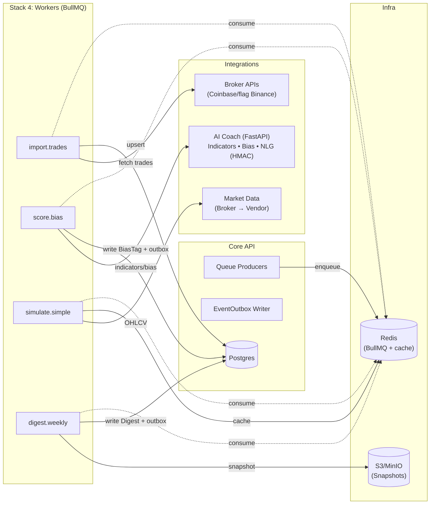
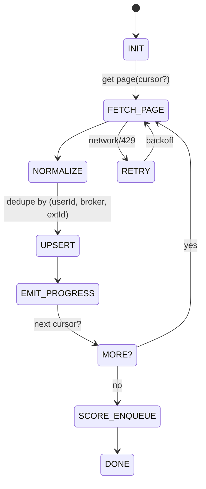
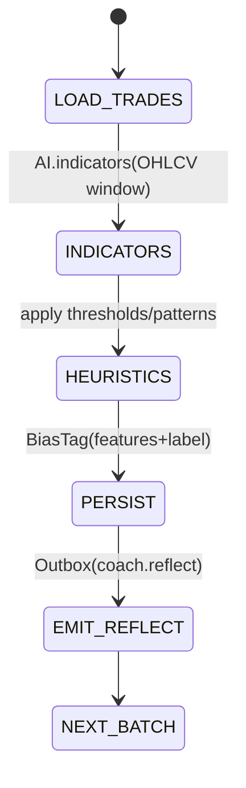
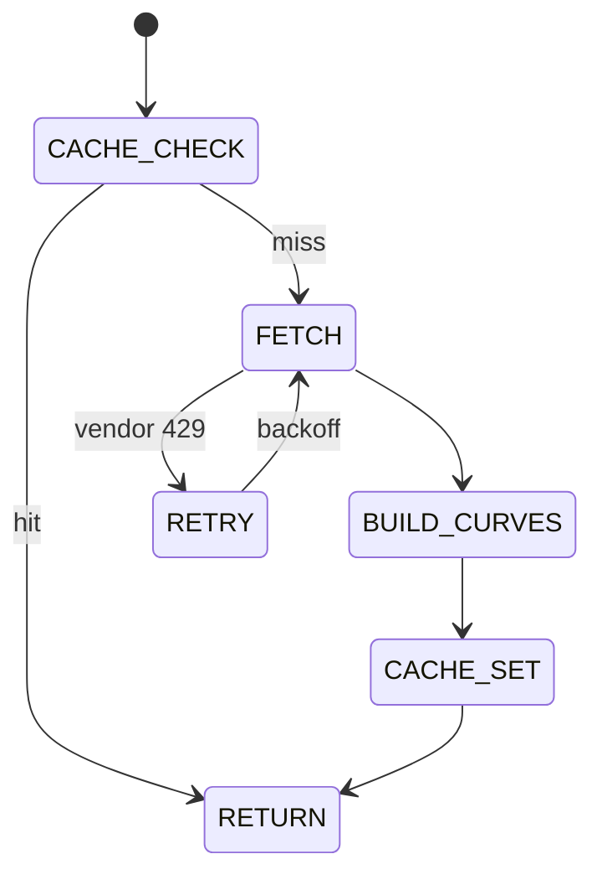
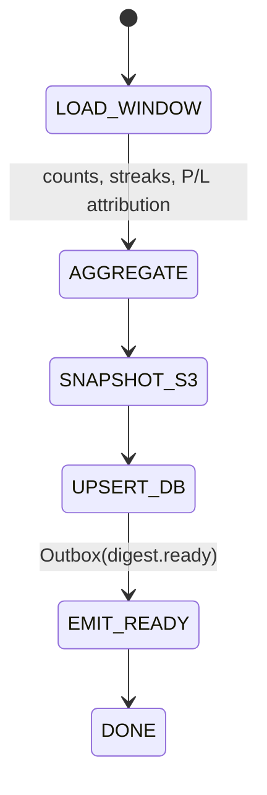

# 06 — Stack 4: Workers (BullMQ, Node) — Structure, Diagrams, Pseudocode

## Purpose & Responsibilities

* Execute **background jobs** decoupled from HTTP:

  * `import.trades` — fetch & normalize broker trades, upsert to DB, emit progress.
  * `score.bias` — compute indicators, apply heuristics, persist `BiasTag`, emit `coach.reflect`.
  * `simulate.simple` — build hold-vs-actual curves, cache, return delta.
  * `digest.weekly` — aggregate 7-day stats, persist `Digest`, emit `digest.ready`.
* Guarantee **idempotency**, **retries with backoff**, and **observability**.
* Use Core’s **domain repos** (Postgres via Prisma), **Redis** for queues/cache, **S3** for weekly snapshots.
* Call **Broker APIs**, **Market-Data adapter**, and **AI Coach** (HMAC-signed).

> These run as a **separate process** from S3 Core API but share domain code (packages).

---

## Topology (Mermaid)



---

## Queues & Job Contracts

### Queue names

* `q_import`, `q_score`, `q_sim`, `q_digest`

### Job data shapes (TypeScript)

```ts
// q_import
export type ImportJob = {
  userId: string;
  sinceIso: string;         // ISO date (inclusive), default: now-30d
  broker?: 'coinbase'|'binance';
};

// q_score
export type ScoreJob = {
  userId: string;
  sinceIso: string;         // re-score window; can be same as import
};

// q_sim
export type SimJob = {
  userId: string;
  tradeId: string;
  horizonDays: number;      // e.g., 7
};

// q_digest
export type DigestJob = {
  userId: string;
  periodStart: string;      // YYYY-MM-DD
  periodEnd: string;        // YYYY-MM-DD (exclusive or inclusive per spec)
};
```

### Deterministic job IDs

* Import: `sha256(userId|sinceIso|broker?)`
* Score: `sha256(userId|sinceIso)`
* Sim: `sha256(userId|tradeId|horizonDays)`
* Digest: `sha256(userId|periodStart|periodEnd)`

> Ensures **idempotent enqueues** and natural dedupe across retries.

---

## Project Structure

```
apps/workers/
  src/
    env.ts
    logger.ts
    metrics.ts
    index.ts               # bootstrap, register workers
    jobBase.ts             # common wrapper (logging, retries, SLO timers)
    adapters/
      broker/
        coinbase.ts
        binance.ts
      marketData.ts
      aiClient.ts          # HMAC to FastAPI
    repos/                 # thin wrappers importing from core shared domain
      TradeRepo.ts
      BiasRepo.ts
      DigestRepo.ts
      OutboxRepo.ts
      BrokerConnRepo.ts
    handlers/
      import.handler.ts
      score.handler.ts
      sim.handler.ts
      digest.handler.ts
  test/
    unit/
    integration/
```

> Repos here are light wrappers that reuse Prisma models from a shared package (or import from `apps/core` if extracted). Keep **schema identical** to “02 — Data & ERD”.

---

## Lifecycle & Failure Matrix

| Worker            | Retry/backoff                     | DLQ? | Idempotency                                             | External Limits                                   |
| ----------------- | --------------------------------- | ---- | ------------------------------------------------------- | ------------------------------------------------- |
| `import.trades`   | 5 retries, exp backoff (1s → 60s) | Yes  | Upsert by `(userId, broker, extId)`; page cursor dedupe | Respect broker rate limits; 429 → backoff         |
| `score.bias`      | 3 retries, exp backoff            | Yes  | Bias by `(tradeId,label)` within window; re-tag allowed | AI timeout 2s; 5xx → retry                        |
| `simulate.simple` | 2 retries, linear (1s, 5s)        | No   | Cache key `(userId, tradeId, horizonDays, source)`      | Vendor 429 → short backoff; return cached/partial |
| `digest.weekly`   | 3 retries, exp backoff            | Yes  | Digest upsert by `(userId, period)`                     | N/A                                               |

---

## State Machines (Mermaid)

### A) `import.trades`



### B) `score.bias`



### C) `simulate.simple`



### D) `digest.weekly`



---

## Handlers — Pseudocode

### `handlers/import.handler.ts`

```ts
import { BrokerAdapter } from '../adapters/broker/coinbase'; // interface
import { TradeRepo, OutboxRepo, BrokerConnRepo } from '../repos';
import dayjs from 'dayjs';

export async function importHandler(job: Job<ImportJob>) {
  const { userId } = job.data;
  const sinceIso = job.data.sinceIso ?? dayjs().subtract(30, 'day').toISOString();
  const conn = await BrokerConnRepo.getActive(userId); // throws if none
  const adapter: BrokerAdapter = BrokerConnRepo.adapterFor(conn);

  let cursor: string | undefined = undefined;
  let storedTotal = 0, fetchedTotal = 0;
  do {
    const page = await adapter.fetchTrades({ accessToken: conn.access, sinceIso, cursor });
    fetchedTotal += page.trades.length;

    const normalized = page.trades.map(normalizeTrade(userId, conn.broker));
    const stored = await TradeRepo.upsertMany(userId, normalized); // dedupe by (userId, broker, extId)
    storedTotal += stored;

    await OutboxRepo.append(userId, 'import.progress', {
      jobId: job.id, percent: page.percent ?? estimatePercent(cursor, page.next),
      fetched: fetchedTotal, stored: storedTotal
    });

    cursor = page.next;
    await respectRateLimits(page.rateLimit); // sleep if needed
  } while (cursor);

  // enqueue scoring for this window
  await job.queue.add(
    'score', { userId, sinceIso } as ScoreJob,
    { jobId: hash(`${userId}|${sinceIso}`) }
  );
}
```

### `handlers/score.handler.ts`

```ts
import { TradeRepo, BiasRepo, OutboxRepo } from '../repos';
import { AiClient } from '../adapters/aiClient';
import { MarketData } from '../adapters/marketData';

export async function scoreHandler(job: Job<ScoreJob>) {
  const { userId, sinceIso } = job.data;
  const batch = TradeRepo.streamSince(userId, sinceIso, 200); // async iterator

  for await (const trades of batch) {
    // fetch compact OHLCV windows per symbol (minimize vendor calls)
    const symbols = unique(trades.map(t => t.symbol));
    const ohlcvMap = await MarketData.preload(symbols, '1h', windowFrom(sinceIso));

    for (const t of trades) {
      const window = ohlcvMap.get(t.symbol)!;
      const indicators = await AiClient.indicators({ series: window, ts: t.ts });
      const tag = heuristics(indicators, t); // label + confidence + features summary

      await BiasRepo.create({
        tradeId: t.id, label: tag.label, confidence: tag.confidence, features: tag.features
      });

      await OutboxRepo.append(userId, 'coach.reflect', {
        tradeId: t.id,
        labels: [{ name: tag.label, confidence: tag.confidence }],
        insight: await AiClient.nlgReflect({ features: tag.features, label: tag.label, tone: 'supportive' }),
        sparklines: miniSpark(window, t.ts),
        tone: 'supportive'
      });
    }
  }
}
```

### `handlers/sim.handler.ts`

```ts
import { TradeRepo } from '../repos';
import { MarketData } from '../adapters/marketData';
import { redis } from '../infra/redis';

export async function simHandler(job: Job<SimJob>) {
  const { userId, tradeId, horizonDays } = job.data;
  const cacheKey = `sim:${userId}:${tradeId}:${horizonDays}`;
  const hit = await redis.get(cacheKey);
  if (hit) return JSON.parse(hit);

  const t = await TradeRepo.byId(userId, tradeId);
  const to = addDays(t.ts, horizonDays);
  const series = await MarketData.getOHLCV(t.symbol, '1h', t.ts, to);

  const curves = buildCurves(t, series);     // actual vs hold
  const delta = curves.holdPnL - curves.actualPnL;

  const res = { curves, delta };
  await redis.setEx(cacheKey, 3600, JSON.stringify(res)); // 1h TTL
  return res;
}
```

### `handlers/digest.handler.ts`

```ts
import { DigestRepo, TradeRepo, BiasRepo, OutboxRepo } from '../repos';
import { s3 } from '../infra/s3';

export async function digestHandler(job: Job<DigestJob>) {
  const { userId, periodStart, periodEnd } = job.data;

  const trades = await TradeRepo.listRange(userId, periodStart, periodEnd);
  const biases = await BiasRepo.listForTrades(trades.map(t => t.id));

  const agg = aggregateWeekly(trades, biases); // counts by label, P/L attribution, streaks, top insight
  await s3.putJson(`digests/${userId}/${periodStart}-${periodEnd}.json`, agg);

  const digest = await DigestRepo.upsertLatest(userId, { start: periodStart, end: periodEnd }, agg);

  await OutboxRepo.append(userId, 'digest.ready', {
    digestId: digest.id, period: { start: periodStart, end: periodEnd }
  });
}
```

---

## Common Wrapper & Metrics

### `jobBase.ts`

```ts
export function withJobBase<T>(name: string, handler: (job: Job<T>) => Promise<any>) {
  return async (job: Job<T>) => {
    const start = Date.now();
    try {
      const res = await handler(job);
      metrics.observeDuration(name, Date.now()-start, 'ok');
      return res;
    } catch (e:any) {
      metrics.observeDuration(name, Date.now()-start, 'err');
      logger.error({ err: e, job: job.id, name }, 'job failed');
      throw e; // BullMQ handles retries/DLQ
    }
  };
}
```

### SLO targets (Workers)

* Import 30-day window: **p95 ≤ 60s** on 500 trades.
* Reflect push latency (BiasTag → Outbox write → Edge WS): **median ≤ 1.5s**, **p95 ≤ 3s**.
* Sim compute: **p95 ≤ 1s** on cached OHLCV; **p95 ≤ 3s** cold.
* Digest job: **≤ 5s** per user.

---

## Adapters (sketch)

### `adapters/broker/coinbase.ts`

```ts
export interface BrokerAdapter {
  fetchTrades(args: { accessToken: string; sinceIso: string; cursor?: string }): Promise<{
    trades: Array<{ id:string; symbol:string; side:'BUY'|'SELL'; qty:number; price:number; fee?:number; ts:string }>;
    next?: string;
    percent?: number;
    rateLimit?: { remaining:number; resetMs:number };
  }>;
}
```

### `adapters/marketData.ts`

```ts
export const MarketData = {
  async getOHLCV(symbol: string, granularity: '1h'|'1d', fromIso: string, toIso: string) {
    // try broker OHLCV; else vendor fallback; cache in Redis
  },
  async preload(symbols: string[], granularity: '1h'|'1d', fromIso: string) {
    // bulk fetch with caching; return Map<symbol, Series>
  }
};
```

### `adapters/aiClient.ts`

```ts
export const AiClient = {
  async indicators(payload: { series: any; ts: string }) {
    // POST /v1/indicators with HMAC headers; timeout 2000ms
  },
  async nlgReflect(payload: { features:any; label:string; tone:'supportive'|'strict' }) {
    // POST /v1/nlg/reflect (short JSON string response)
  }
};
```

---

## Observability

* **Metrics (Prometheus)**

  * `job_duration_ms{job=...,status=ok|err}`
  * `queue_depth{queue=...}` (BullMQ)
  * `vendor_429_total{source=broker|vendor}`
  * `ai_request_ms{endpoint=...}`
  * `event_outbox_writes_total`

* **Logs (Pino JSON)**

  * Include `jobId`, `userId`, `queue`, `attempt`.
  * Redact tokens.
  * Log 429s with reset time.

* **Tracing (OpenTelemetry)**

  * Spans around handler steps: fetch → normalize → upsert → outbox.

---

## Testing

**Unit**

* Import: cursor paging & dedupe; progress events content.
* Score: indicators mocked → heuristic labels; outbox payload shape.
* Sim: cache hit/miss; delta math; vendor 429 backoff path.
* Digest: aggregation math; S3 key path; outbox event.

**Integration (Testcontainers)**

* Postgres + Redis + stubbed broker & AI services.
* Full flow: enqueue import → trades in DB → score → outbox rows observed.
* Replay: after outbox writes, Core’s `/internal/events?since` returns events in order.

**Chaos / Failure**

* Kill AI service: score retries & DLQ after 3 attempts.
* Broker 429 storm: import backs off; completes under global retry budget.
* Redis restart: idempotent job IDs prevent duplication.

---

## Environment Variables

* `REDIS_URL` — BullMQ & cache
* `DATABASE_URL` — Prisma Postgres
* `S3_ENDPOINT`, `S3_BUCKET`, `S3_ACCESS_KEY`, `S3_SECRET_KEY`
* `AI_BASE_URL`, `AI_HMAC_KEY_ID`, `AI_HMAC_SECRET`, `AI_TIMEOUT_MS=2000`
* `BROKER_RATE_LIMIT_SAFETY_MS=250`
* `WORKER_CONCURRENCY_IMPORT=2`, `..._SCORE=2`, `..._SIM=4`, `..._DIGEST=1`
* `LOG_LEVEL=info`

---

## Security Notes

* Never log `accessEnc/refreshEnc` or raw broker responses with secrets.
* HMAC: include `X-KeyId`, `X-Timestamp`, `X-Signature`; reject clock skew > ±5m; cache nonces to prevent replay.
* Market-data vendor keys stored via secrets manager; never in logs.
* S3 paths must not contain PII; use user IDs, not emails.

---

## Open Questions

* Import progress **percent**: broker-reported vs heuristic (pages processed / guess). (MVP: show count-based estimate.)
* Bias heuristics **threshold tuning**: handled in Rules personalization later; for now static v1 thresholds.
* Digest **P/L attribution** data source: per-trade realized P/L vs modelled on price movement; MVP: simple model.
