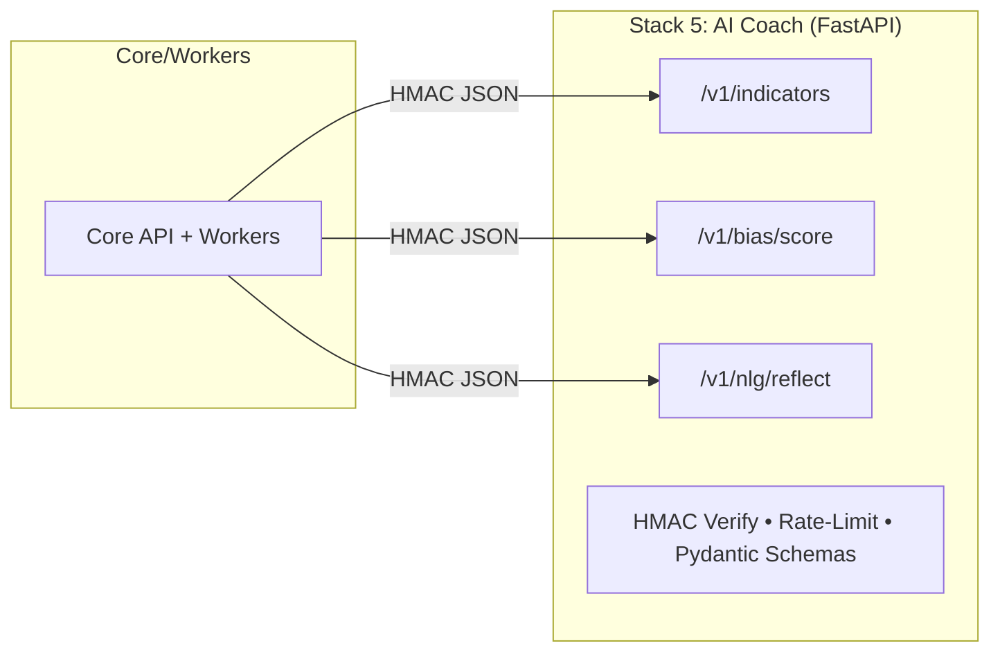

# 07 — Stack 5: AI Coach (FastAPI, Python) — Structure, Endpoints, Heuristics, Pseudocode

## Purpose & Responsibilities

* Stateless **HTTP microservice** used by Core/Workers for:

  * **Indicators** on OHLCV windows (deterministic, vectorized).
  * **Bias scoring** (rule-based heuristics over indicators + trade context).
  * **NLG reflection** (short, safe, tone-aware phrasing of insights).
* **Does not store PII or tokens.** No DB. Small in-memory caches OK.
* **Security:** HMAC-signed requests from Core; strict JSON schemas; rate limits; timeouts.

---

## Architecture (Mermaid)



---

## Public Surface (internal-only)

**Base URL:** `AI_BASE_URL` (private network)
**Headers (required):**

* `X-KeyId: <string>`
* `X-Timestamp: <ISO8601>` (±300s skew allowed)
* `X-Signature: <hex HMAC-SHA256(secret, X-Timestamp + body)>`
* `Content-Type: application/json`

**Endpoints:**

* `POST /v1/indicators` → compute vectorized indicators on an OHLCV window.
* `POST /v1/bias/score` → apply heuristics to produce `{label, confidence, features}`.
* `POST /v1/nlg/reflect` → produce short, tone-aware text about the bias (no trade advice).

---

## Schemas (Pydantic)

```python
# common.py
from pydantic import BaseModel, Field, conlist, conint, confloat
from typing import Literal, List, Optional

class Candle(BaseModel):
    ts: str                       # ISO8601 UTC
    open: confloat(strict=True)
    high: confloat(strict=True)
    low:  confloat(strict=True)
    close: confloat(strict=True)
    volume: confloat(strict=True)

class Series(BaseModel):
    symbol: str
    granularity: Literal["1m","5m","15m","1h","4h","1d"]
    candles: conlist(Candle, min_items=50)  # ensure enough history

class TradeCtx(BaseModel):
    side: Literal["BUY","SELL"]
    entry_ts: str                 # ISO8601
    entry_price: confloat(gt=0)
    lookback_hours: conint(ge=1, le=168) = 24

class IndicatorsRequest(BaseModel):
    series: Series
    # parameters (optional; defaults match heuristics config)
    rsi_period: conint(ge=2, le=200) = 14
    bb_period: conint(ge=2, le=200) = 20
    bb_std: confloat(gt=0, le=5) = 2.0
    ema_fast: conint(ge=2, le=200) = 12
    ema_slow: conint(ge=2, le=400) = 26
    atr_period: conint(ge=2, le=200) = 14

class IndicatorsResponse(BaseModel):
    rsi: List[float]
    ema_fast: List[float]
    ema_slow: List[float]
    bb_mid: List[float]
    bb_upper: List[float]
    bb_lower: List[float]
    atr: List[float]

class BiasScoreRequest(BaseModel):
    series: Series
    trade: TradeCtx
    # rule thresholds (mirrors Rule.params; can be overridden by Core personalization)
    spike_pct: confloat(gt=0, le=50) = 8.0          # FOMO spike threshold
    spike_window_h: conint(ge=1, le=72) = 24
    red_candles_min: conint(ge=1, le=8) = 2         # discipline: buy after pullback
    panic_dd_pct: confloat(gt=0, le=80) = 10.0      # PANIC drawdown threshold
    panic_window_h: conint(ge=1, le=72) = 24
    rsi_overbought: confloat(gt=40, le=100) = 70.0
    rsi_oversold: confloat(gt=0, le=60) = 30.0

class BiasScoreResponse(BaseModel):
    label: Literal["FOMO","PANIC","DISCIPLINE","NEUTRAL"]
    confidence: confloat(ge=0, le=1)
    features: dict

class NlgRequest(BaseModel):
    label: Literal["FOMO","PANIC","DISCIPLINE","NEUTRAL"]
    features: dict
    tone: Literal["supportive","strict"] = "supportive"
    max_chars: conint(ge=60, le=300) = 220

class NlgResponse(BaseModel):
    insight: str  # <= max_chars, no imperatives to buy/sell
```

---

## Heuristics v1 (deterministic, explainable)

> These rules operate at the **trade’s timestamp** using the **preceding window** from `series`. They return a primary label and a compact `features` dict for transparency and NLG.

### 1) FOMO (buying into a spike / selling into hype)

Trigger when:

* **BUY** occurred after **price spike** ≥ `spike_pct` within last `spike_window_h` hours **and**
* RSI at entry ≥ `rsi_overbought` **or** candle sequence shows ≥2 consecutive green closes pre-entry.

Confidence:

* Base 0.6; +0.2 if spike ≥ (spike\_pct + 50% of threshold); +0.2 if RSI ≥ 75 or 3+ green candles. Clamp \[0,1].

Features:

* `{ spike_pct, window_h, rsi_entry, greens_streak, price_vs_bb_upper }`

### 2) PANIC (selling into drawdown / capitulation)

Trigger when:

* **SELL** occurred after **drawdown** ≥ `panic_dd_pct` over last `panic_window_h` hours **and**
* close < `bb_lower` at/near entry\_ts **or** RSI ≤ `rsi_oversold`.

Confidence:

* Base 0.6; +0.2 if below BB lower by >1 std; +0.2 if RSI ≤ 25. Clamp \[0,1].

Features:

* `{ dd_pct, window_h, rsi_entry, below_bb_sd }`

### 3) DISCIPLINE (counter-FOMO pattern)

Trigger when:

* **BUY** occurs **after pullback** (≥ `red_candles_min` reds) or RSI rising from oversold cross **and**
* entry near EMA crossover zone (ema\_fast crossing above ema\_slow within last N candles) **or** price near BB mid.

Confidence:

* Base 0.5; +0.2 if oversold cross up; +0.2 if EMA fast>slow at entry; +0.1 if price ≤ bb\_mid.

Features:

* `{ reds_streak, rsi_cross_up, ema_fast>slow, price_vs_bb_mid }`

### 4) NEUTRAL

Fallback when none strongly trigger (max confidence < 0.55).

---

## Implementation Sketches

### App boot & security

```python
# main.py
from fastapi import FastAPI, Request, Response, Depends, HTTPException
from fastapi.middleware.gzip import GZipMiddleware
from starlette.middleware.cors import CORSMiddleware
import time

app = FastAPI(title="AI Coach", version="v1")
app.add_middleware(GZipMiddleware, minimum_size=512)

# optional: restrict origins to Core/Workers private nets if CORS needed
app.add_middleware(CORSMiddleware, allow_origins=[], allow_methods=["POST"])

from security import verify_hmac, rate_limit

@app.post("/v1/indicators", dependencies=[Depends(verify_hmac), Depends(rate_limit)])
async def indicators(req: IndicatorsRequest) -> IndicatorsResponse:
    return compute_indicators(req)

@app.post("/v1/bias/score", dependencies=[Depends(verify_hmac), Depends(rate_limit)])
async def bias_score(req: BiasScoreRequest) -> BiasScoreResponse:
    ind = compute_indicators(IndicatorsRequest(series=req.series))
    return apply_heuristics(req, ind)

@app.post("/v1/nlg/reflect", dependencies=[Depends(verify_hmac), Depends(rate_limit)])
async def nlg_reflect(req: NlgRequest) -> NlgResponse:
    return generate_nlg(req)
```

### HMAC verification & rate limiting

```python
# security.py
import hmac, hashlib, time, os
from fastapi import Header, HTTPException, Request
from aiocache import caches

AI_KEYS = { os.getenv("AI_HMAC_KEY_ID"): os.getenv("AI_HMAC_SECRET") }
NONCE_CACHE = caches.get("default")  # Redis recommended in prod

async def verify_hmac(request: Request,
                      x_keyid: str = Header(..., alias="X-KeyId"),
                      x_ts: str = Header(..., alias="X-Timestamp"),
                      x_sig: str = Header(..., alias="X-Signature")):
    if x_keyid not in AI_KEYS: raise HTTPException(401, "key")
    body = await request.body()
    msg = (x_ts + body.decode("utf-8")).encode("utf-8")
    expected = hmac.new(AI_KEYS[x_keyid].encode(), msg, hashlib.sha256).hexdigest()
    if not hmac.compare_digest(expected, x_sig): raise HTTPException(401, "sig")
    # replay window
    t = int(time.time())
    try_ts = int(time.strptime(x_ts, "%Y-%m-%dT%H:%M:%SZ").timestamp())
    if abs(t - try_ts) > 300: raise HTTPException(401, "skew")
    # optional: nonce cache for stronger replay prevention if header present
    return True

# simple token-bucket per key (swap for Redis in prod)
TOKENS = {}
def rate_limit(x_keyid: str = Header(..., alias="X-KeyId")):
    now = time.time()
    bucket = TOKENS.get(x_keyid, {"t": now, "tokens": 30})
    # refill at 30 rps up to 60
    bucket["tokens"] = min(60, bucket["tokens"] + (now - bucket["t"]) * 30)
    bucket["t"] = now
    if bucket["tokens"] < 1: raise HTTPException(429, "rate")
    bucket["tokens"] -= 1
    TOKENS[x_keyid] = bucket
```

### Indicators (vectorized; deterministic)

```python
# indicators.py
import numpy as np

def ema(x: np.ndarray, span: int) -> np.ndarray:
    alpha = 2 / (span + 1)
    y = np.empty_like(x); y[0] = x[0]
    for i in range(1, x.size):
        y[i] = alpha * x[i] + (1 - alpha) * y[i-1]
    return y

def rsi(close: np.ndarray, period: int = 14) -> np.ndarray:
    delta = np.diff(close, prepend=close[0])
    gain = np.maximum(delta, 0); loss = np.maximum(-delta, 0)
    avg_gain = ema(gain, period); avg_loss = ema(loss, period) + 1e-12
    rs = avg_gain / avg_loss
    return 100 - (100 / (1 + rs))

def bollinger(close: np.ndarray, period:int=20, std:float=2.0):
    roll_mean = rolling_mean(close, period)
    roll_std  = rolling_std(close, period)
    mid = roll_mean
    upper = mid + std * roll_std
    lower = mid - std * roll_std
    return mid, upper, lower

def atr(high, low, close, period=14):
    tr = np.maximum(high[1:], close[:-1]) - np.minimum(low[1:], close[:-1])
    tr = np.insert(tr, 0, high[0]-low[0])
    return ema(tr, period)

def compute_indicators(req: IndicatorsRequest) -> IndicatorsResponse:
    c = np.array([c.close for c in req.series.candles], dtype=np.float64)
    h = np.array([c.high for c in req.series.candles], dtype=np.float64)
    l = np.array([c.low  for c in req.series.candles], dtype=np.float64)

    rsi_v = rsi(c, req.rsi_period)
    ema_f = ema(c, req.ema_fast)
    ema_s = ema(c, req.ema_slow)
    bb_m, bb_u, bb_l = bollinger(c, req.bb_period, req.bb_std)
    atr_v = atr(h, l, c, req.atr_period)

    # return full arrays; Core/Workers pick aligned index by entry_ts
    return IndicatorsResponse(
        rsi=rsi_v.tolist(),
        ema_fast=ema_f.tolist(),
        ema_slow=ema_s.tolist(),
        bb_mid=bb_m.tolist(),
        bb_upper=bb_u.tolist(),
        bb_lower=bb_l.tolist(),
        atr=atr_v.tolist()
    )
```

### Bias heuristics (rule-based, index-aligned)

```python
# heuristics.py
import numpy as np
from datetime import datetime, timezone, timedelta

def idx_at_ts(candles, ts_iso):
    # find the last candle with ts <= entry_ts
    ts = datetime.fromisoformat(ts_iso.replace("Z","+00:00"))
    arr = [datetime.fromisoformat(c.ts.replace("Z","+00:00")) for c in candles]
    i = max(i for i,t in enumerate(arr) if t <= ts)
    return i

def pct_change(a, b):  # from a to b
    return (b - a) / a * 100.0 if a else 0.0

def rolling_drawdown(close, window):
    # max peak-to-trough in window (positive %)
    peak = np.max(close)
    trough = np.min(close)
    return pct_change(peak, trough) * -1

def apply_heuristics(req: BiasScoreRequest, ind: IndicatorsResponse) -> BiasScoreResponse:
    candles = req.series.candles
    i = idx_at_ts(candles, req.trade.entry_ts)
    # slice window
    window_h = req.trade.lookback_hours
    # convert hours to N candles by granularity
    g = req.series.granularity
    per_hour = {"1m":60,"5m":12,"15m":4,"1h":1,"4h":1/4,"1d":1/24}[g]
    n = max(1, int(window_h * per_hour))
    start = max(0, i - n + 1)

    closes = np.array([c.close for c in candles[start:i+1]])
    highs  = np.array([c.high  for c in candles[start:i+1]])
    lows   = np.array([c.low   for c in candles[start:i+1]])
    # entry refs
    entry_price = req.trade.entry_price
    rsi_entry   = ind.rsi[i]
    bb_u = ind.bb_upper[i]
    bb_m = ind.bb_mid[i]
    bb_l = ind.bb_lower[i]
    ema_f = ind.ema_fast[i]
    ema_s = ind.ema_slow[i]

    # streak counts (greens/reds) before entry
    seq = np.sign(np.diff([c.close for c in candles[start:i+1]])).tolist()
    greens_streak = sum(1 for x in seq[::-1] if x > 0)
    reds_streak   = sum(1 for x in seq[::-1] if x < 0)

    # spike & drawdown over windows
    spike_pct = pct_change(closes.max(initial=entry_price), entry_price)  # how far entry is above prior levels
    dd_pct    = pct_change(closes.max(), closes.min()) * -1               # positive number

    # Flags
    fomo = (
        req.trade.side == "BUY" and
        spike_pct >= req.spike_pct and
        (rsi_entry >= req.rsi_overbought or greens_streak >= 2)
    )
    panic = (
        req.trade.side == "SELL" and
        dd_pct >= req.panic_dd_pct and
        (entry_price <= bb_l or rsi_entry <= req.rsi_oversold)
    )
    discipline = (
        req.trade.side == "BUY" and
        (reds_streak >= req.red_candles_min or (ind.rsi[i-1] < req.rsi_oversold and rsi_entry > ind.rsi[i-1])) and
        ((ema_f > ema_s) or (entry_price <= bb_m))
    )

    label = "NEUTRAL"; conf = 0.5
    if fomo:
        label = "FOMO"
        conf = 0.6 + 0.2 * (spike_pct >= req.spike_pct * 1.5) + 0.2 * (rsi_entry >= 75 or greens_streak >= 3)
    elif panic:
        label = "PANIC"
        below_sd = max(0.0, (bb_l - entry_price)) / max(1e-9, (bb_u - bb_m))  # approx stds below
        conf = 0.6 + 0.2 * (below_sd > 1.0) + 0.2 * (rsi_entry <= 25)
    elif discipline:
        label = "DISCIPLINE"
        conf = 0.5 + 0.2 * (ind.rsi[i-1] < req.rsi_oversold and rsi_entry > ind.rsi[i-1]) + 0.2 * (ema_f > ema_s) + 0.1 * (entry_price <= bb_m)

    conf = float(min(1.0, max(0.0, conf)))

    features = {
        "rsi_entry": round(rsi_entry, 2),
        "greens_streak": greens_streak,
        "reds_streak": reds_streak,
        "spike_pct": round(spike_pct, 2),
        "dd_pct": round(dd_pct, 2),
        "price_vs_bb_upper": round((entry_price - bb_u) / max(1e-9, bb_u) * 100, 2),
        "price_vs_bb_mid": round((entry_price - bb_m) / max(1e-9, bb_m) * 100, 2),
        "ema_fast_gt_slow": bool(ema_f > ema_s),
        "granularity": req.series.granularity,
        "window_h": window_h
    }

    return BiasScoreResponse(label=label, confidence=conf, features=features)
```

### NLG (short, safe, tone-aware)

```python
# nlg.py
TEMPLATES = {
  "FOMO": {
    "supportive": "Looks like a momentum chase: price spiked ~{spike_pct}% in {window_h}h and RSI was {rsi_entry}. Next time, pause after streaks and wait for a pullback signal.",
    "strict":     "Classic FOMO. You jumped after a ~{spike_pct}% pop with RSI {rsi_entry}. Stop chasing green candles; wait for confirmation."
  },
  "PANIC": {
    "supportive": "This sell followed a drawdown of ~{dd_pct}% with RSI {rsi_entry}. Consider pre-set exits to avoid emotion-driven capitulation.",
    "strict":     "Panic exit detected: ~{dd_pct}% drop and RSI {rsi_entry}. Define your exits before the drop, not during it."
  },
  "DISCIPLINE": {
    "supportive": "Disciplined entry: after a pullback and near trend support (EMA/BB mid). Keep repeating this setup.",
    "strict":     "Good discipline: entered post-pullback near support. Stay systematic."
  },
  "NEUTRAL": {
    "supportive": "No strong pattern detected. Log your reason for this trade to train your clone.",
    "strict":     "Pattern unclear. Define your entry rules and stick to them."
  }
}

def generate_nlg(req: NlgRequest) -> NlgResponse:
    tpl = TEMPLATES[req.label][req.tone]
    # limit fields we interpolate (avoid prompt injection via features)
    safe = {k: req.features.get(k) for k in ("spike_pct","window_h","rsi_entry","dd_pct") if k in req.features}
    text = tpl.format(**{k: (round(v,2) if isinstance(v,(int,float)) else v) for k,v in safe.items()})
    # length clamp
    text = text[:req.max_chars]
    return NlgResponse(insight=text)
```

---

## Operational Concerns

* **Timeouts:** app-level 2s per request (configurable, `AI_TIMEOUT_MS`).
* **Body limits:** `Content-Length` ≤ 512 KB (OHLCV windows are compact).
* **Concurrency:** uvicorn workers = `min(2, CPU)`; limit per-key rate to avoid abuse.
* **Determinism:** no RNG; same inputs → same outputs.
* **Metrics:** Prometheus (via `prometheus_fastapi_instrumentator`)

  * `http_request_duration_seconds`
  * `ai_indicators_ms`, `ai_bias_score_ms`, `ai_nlg_ms`
* **Logging:** JSON lines; include request id; redact bodies (store only shapes/length).
* **Testing:** Pytest numerics (golden OHLCV fixtures), property tests (RSI monotonicity), schema conformance, HMAC negative tests, rate-limit tests.

---

## Example Requests

**Indicators:**

```json
POST /v1/indicators
{
  "series": { "symbol":"BTC-USD","granularity":"1h","candles":[{ "ts":"2025-08-28T00:00:00Z","open":... } ... ] },
  "rsi_period": 14, "bb_period": 20, "bb_std": 2.0
}
```

**Bias score:**

```json
POST /v1/bias/score
{
  "series": { "...": "..." },
  "trade":  { "side":"BUY","entry_ts":"2025-08-31T14:00:00Z","entry_price":24150,"lookback_hours":24 },
  "spike_pct": 8.0, "panic_dd_pct": 10.0
}
```

**NLG:**

```json
POST /v1/nlg/reflect
{ "label":"FOMO","features":{"spike_pct":12.4,"window_h":24,"rsi_entry":78.1},"tone":"supportive","max_chars":220 }
```

---

## Project Structure

```
apps/ai-coach/
  src/
    main.py             # FastAPI app; mount routes; middlewares
    security.py         # HMAC verify, rate-limit
    schemas.py          # Pydantic models
    indicators.py       # vectorized TA
    heuristics.py       # rule-based bias detection
    nlg.py              # short templates, clamp
    metrics.py          # prometheus instrumentator
    config.py           # env parsing (pydantic-settings)
    utils.py
  tests/
    unit/
      test_rsi.py
      test_bollinger.py
      test_heuristics_fomo.py
      test_hmac.py
      test_nlg_length.py
    fixtures/
      ohlcv_btc_1h.json
      trade_examples.json
  Dockerfile
  pyproject.toml
```

---

## Environment Variables

* `AI_HMAC_KEY_ID`, `AI_HMAC_SECRET`
* `AI_RATE_RPS=30`, `AI_RATE_BURST=60`
* `AI_TIMEOUT_MS=2000`
* `LOG_LEVEL=info`
* `PROMETHEUS_ENABLED=true`

---

## SLOs

* **Indicators:** p95 ≤ 50ms (1k candles)
* **Bias score:** p95 ≤ 80ms (includes indicators)
* **NLG reflect:** p95 ≤ 40ms
* 99.9% correctness: deterministic outputs for fixed fixtures.

---

## Safety & Compliance

* Strictly **behavioral coaching**, not financial advice; templates avoid imperatives to trade.
* No user PII; only symbol/time/price & derived features.
* Drop requests failing HMAC/CSRF analog (timestamp skew) with 401; emit metric.
* Clamp and sanitize all outputs; length-limit NLG; no external calls besides Core.
