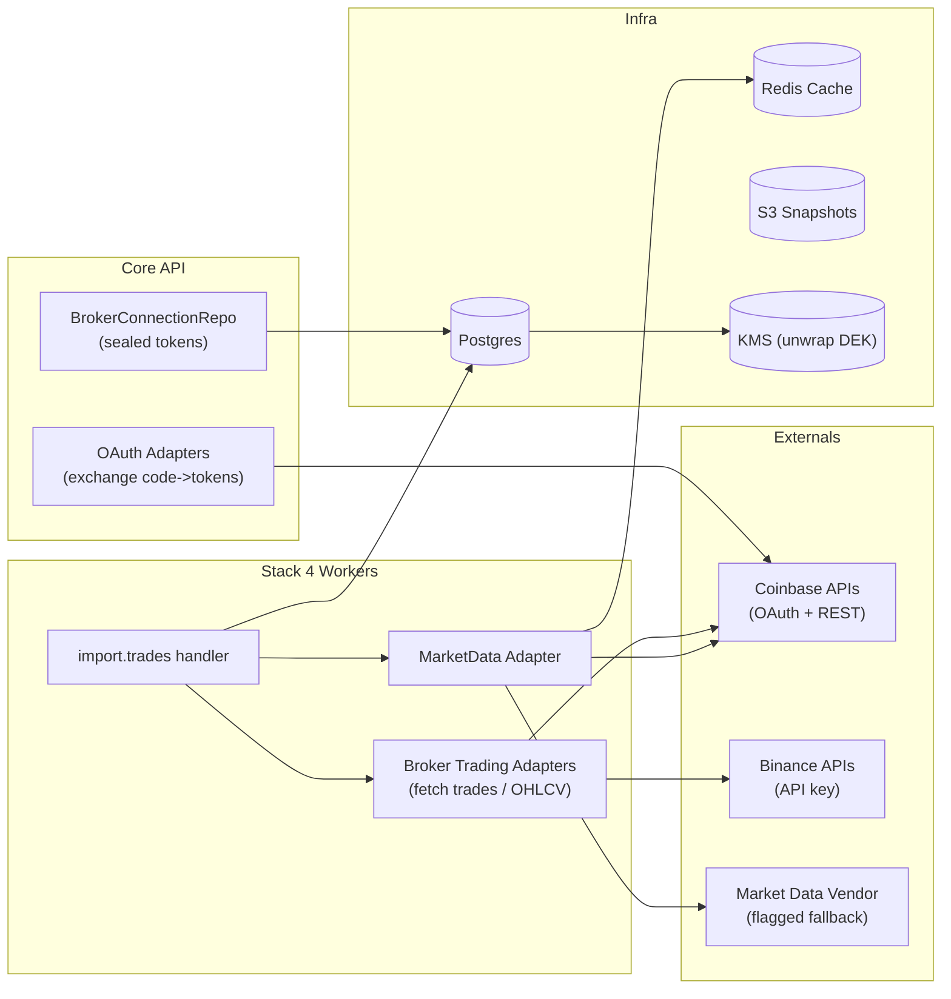

# 08 — Integrations: Broker Adapters & Market Data — Structure, Contracts, Pseudocode

## Purpose & Boundaries

* **Broker Adapters (Trading data):** read-only import of user trades & optional OHLCV from connected brokers.

  * **Primary:** Coinbase (OAuth).
  * **Flagged (later):** Binance (API key/secret).
* **Auth Adapters (OAuth exchange):** used by Core to exchange authorization codes → sealed tokens.
* **Market Data Adapter:** unified OHLCV provider (prefer broker data; fallback to vendor), with caching.

> Security: tokens are **sealed (AES-GCM)** in `BrokerConnection.accessEnc/refreshEnc`. Workers/Core unwrap via DEK (KMS-protected). **Never** log secrets.
> Reliability: resilient to 429/5xx with backoff, deterministic pagination, idempotent inserts by `(userId, broker, extId)`.

---

## Architecture (Mermaid)



---

## Packages & Project Structure

```
packages/integrations/
  src/
    types.ts                     # shared adapter interfaces & DTOs
    broker/
      coinbase.auth.ts           # OAuth code exchange (Core)
      coinbase.trading.ts        # trades/OHLCV (Workers)
      binance.auth.ts            # (flagged) API key helpers
      binance.trading.ts
    market/
      ohlcv.ts                   # unified MarketData adapter
      cache.ts                   # Redis caching helpers
  test/
    coinbase.auth.test.ts
    coinbase.trading.test.ts
    ohlcv.test.ts
```

> Core imports `coinbase.auth.ts` for OAuth exchange; Workers import `*.trading.ts` + `market/ohlcv.ts`.

---

## Canonical DTOs (align to Data & ERD)

```ts
// packages/integrations/src/types.ts
export type NormalizedTrade = {
  extId: string;
  broker: 'coinbase'|'binance';
  symbol: string;                // e.g., "BTC-USD"
  side: 'BUY'|'SELL';
  qty: number;                   // base quantity
  price: number;                 // quote per unit
  fee?: number;
  ts: string;                    // ISO
};

export type TradesPage = {
  trades: NormalizedTrade[];
  next?: string;                 // opaque pagination token
  percent?: number;              // optional progress hint (0..100)
  rateLimit?: { remaining: number; resetMs: number };
};

export type Granularity = '1m'|'5m'|'15m'|'1h'|'4h'|'1d';
export type Candle = { ts: string; open: number; high: number; low: number; close: number; volume: number };
export type OHLCV = { symbol: string; granularity: Granularity; candles: Candle[] };

export interface TradingAdapter {
  fetchTrades(args: { accessToken?: string; apiKey?: string; apiSecret?: string; sinceIso: string; cursor?: string }): Promise<TradesPage>;
  fetchOHLCV?(args: { symbol: string; granularity: Granularity; fromIso: string; toIso: string; accessToken?: string }): Promise<OHLCV>;
}
```

---

## Coinbase — OAuth (Core) Adapter

> Used only by **Core API** during `/internal/brokers/coinbase/connect/callback`.

```ts
// packages/integrations/src/broker/coinbase.auth.ts
export async function exchangeCode({
  code, redirectUri, clientId, clientSecret, pkceVerifier
}: {
  code: string; redirectUri: string; clientId: string; clientSecret: string; pkceVerifier: string;
}): Promise<{ accessToken: string; refreshToken?: string; scope: string; expiresAt?: string }> {
  // POST token endpoint; handle PKCE; map JSON → normalized tokens.
  // NOTE: exact URL/fields depend on Coinbase API version; keep isolated here.
}

export async function refreshToken({ refreshToken, clientId, clientSecret }: {
  refreshToken: string; clientId: string; clientSecret: string;
}): Promise<{ accessToken: string; refreshToken?: string; scope: string; expiresAt?: string }> {
  // POST refresh; return normalized tokens
}
```

* **Sealing**: Core calls `TokenSeal.sealTokens` before persisting into `BrokerConnection`.
* **Logging**: Never log token bodies; log only HTTP status and request ID.

---

## Coinbase — Trading Adapter (Workers)

```ts
// packages/integrations/src/broker/coinbase.trading.ts
import { TradingAdapter, TradesPage, NormalizedTrade, OHLCV, Granularity } from '../types';
import { backoffSleep, redact } from '../util';

export const CoinbaseTrading: TradingAdapter = {
  async fetchTrades({ accessToken, sinceIso, cursor }: { accessToken: string; sinceIso: string; cursor?: string }): Promise<TradesPage> {
    const url = buildTradesUrl({ sinceIso, cursor });
    const res = await fetch(url, { headers: { Authorization: `Bearer ${accessToken}` } });
    if (res.status === 429) { await backoffSleep(res); return this.fetchTrades({ accessToken, sinceIso, cursor }); }
    if (!res.ok) throw new Error(`coinbase trades ${res.status}`);

    const json = await res.json();
    const trades = json.data.map(mapCoinbaseFillToTrade); // normalize → NormalizedTrade
    return { trades, next: json.paging?.next_cursor, rateLimit: parseRateLimit(res) };
  },

  async fetchOHLCV({ symbol, granularity, fromIso, toIso, accessToken }: {
    symbol: string; granularity: Granularity; fromIso: string; toIso: string; accessToken: string;
  }): Promise<OHLCV> {
    const url = buildOHLCVUrl({ symbol, granularity, fromIso, toIso });
    const res = await fetch(url, { headers: { Authorization: `Bearer ${accessToken}` } });
    if (res.status === 429) { await backoffSleep(res); return this.fetchOHLCV({ symbol, granularity, fromIso, toIso, accessToken }); }
    if (!res.ok) throw new Error(`coinbase ohlcv ${res.status}`);

    const rows = await res.json(); // map rows to Candle[]
    return { symbol, granularity, candles: rows.map(mapCandleRow) };
  }
};

// --- helpers (sketches) ---
function buildTradesUrl({ sinceIso, cursor }:{sinceIso:string;cursor?:string}) { /* add query params */ }
function mapCoinbaseFillToTrade(row:any): NormalizedTrade { /* extId, symbol, side, qty, price, fee, ts */ }
function buildOHLCVUrl({symbol,granularity,fromIso,toIso}:{symbol:string;granularity:Granularity;fromIso:string;toIso:string}) { /* ... */ }
function mapCandleRow(r:any): Candle { /* ts, open, high, low, close, volume */ }
function parseRateLimit(res: Response) { /* from headers */ }
```

**Notes**

* Pagination: use broker’s cursor; **do not** fabricate page numbers.
* Timezones: convert broker timestamps to **UTC ISO** early.
* Symbols: map to canonical forms (e.g., `BTC-USD`).
* Side: map broker-specific enums to `'BUY' | 'SELL'`.

---

## Binance — Trading Adapter (Flagged)

> Enable via feature flag/env; keep shape parity with Coinbase adapter.

```ts
// packages/integrations/src/broker/binance.trading.ts
export const BinanceTrading: TradingAdapter = {
  async fetchTrades({ apiKey, apiSecret, sinceIso, cursor }) { /* signed requests; HMAC per Binance */ },
  async fetchOHLCV({ symbol, granularity, fromIso, toIso, accessToken }) { /* public kline endpoint; no accessToken */ }
};
```

* Auth: **HMAC-signed** query with `timestamp`; **do not** store API secret unsealed.
* Rate limits: inspect headers & error codes; backoff with jitter.

---

## Market Data Adapter (Unified)

> Prefer broker OHLCV; if missing/unavailable, fallback to vendor (flagged). All results cached in Redis.

```ts
// packages/integrations/src/market/ohlcv.ts
import { OHLCV, Granularity } from '../types';
import { CoinbaseTrading } from '../broker/coinbase.trading';
import { vendorFetchOHLCV } from './vendor';     // behind feature flag
import { getCache, setCache } from './cache';

const SUPPORTED: Record<Granularity, string> = { '1m':'1m','5m':'5m','15m':'15m','1h':'1h','4h':'4h','1d':'1d' };

export async function getOHLCV({
  source, symbol, granularity, fromIso, toIso, accessToken
}: {
  source: 'broker-first'|'vendor-only'; symbol: string; granularity: Granularity;
  fromIso: string; toIso: string; accessToken?: string;
}): Promise<OHLCV> {
  const key = `ohlcv:${source}:${symbol}:${granularity}:${fromIso}:${toIso}`;
  const cached = await getCache<OHLCV>(key);
  if (cached) return cached;

  let data: OHLCV | null = null;
  if (source !== 'vendor-only' && accessToken) {
    try { data = await CoinbaseTrading.fetchOHLCV({ symbol, granularity, fromIso, toIso, accessToken }); }
    catch (e:any) { if (!is429(e)) console.warn('broker ohlcv fail', e?.message); }
  }
  if (!data) data = await vendorFetchOHLCV({ symbol, granularity, fromIso, toIso });

  // normalize candle continuity if vendor returns uneven edges
  data = normalizeWindow(data, fromIso, toIso, granularity);
  await setCache(key, data, 60 * 60); // 1h TTL
  return data;
}

function normalizeWindow(d: OHLCV, fromIso: string, toIso: string, g: Granularity): OHLCV {
  // Ensure strictly increasing candles, trim outer bounds, fill small gaps if necessary (optional)
  return d;
}
```

---

## Import Handler Integration

> Workers’ `import.handler.ts` calls the trading adapter and writes normalized trades.

```ts
// apps/workers/src/handlers/import.handler.ts (excerpt)
import { CoinbaseTrading } from 'packages/integrations/src/broker/coinbase.trading';
import { openToken } from 'apps/core/src/infra/kms/tokenSeal';

async function runPage(userId: string, sinceIso: string, cursor?: string) {
  const conn = await BrokerConnRepo.getActive(userId);
  const accessToken = await openToken(conn.accessEnc);   // unseal within process memory
  const page = await CoinbaseTrading.fetchTrades({ accessToken, sinceIso, cursor });

  const trades = page.trades.map(t => ({ ...t, broker: 'coinbase' }));
  const stored = await TradeRepo.upsertMany(userId, trades);
  await OutboxRepo.append(userId, 'import.progress', { jobId: job.id, fetched: page.trades.length, stored, percent: page.percent });

  return page.next;
}
```

---

## Security Considerations

* **Token handling:**

  * Unseal only at call time; keep plaintext token in memory minimally; never write to logs, events, or dumps.
  * Prefer short-lived access tokens + refresh flow in Core (worker can request refreshed token via Core if 401/403).
* **HTTP:**

  * TLS only; validate hostnames; set aggressive timeouts (`connect 1s`, `read 3s`).
  * Backoff with jitter for 429/5xx; STOP after bounded retries.
* **Rate limits:**

  * Respect `X-RateLimit-*` headers if provided; otherwise conservative defaults.
  * Centralize backoff policy (`util/backoff.ts`).
* **PII:**

  * No PII in adapter logs. Log broker + code + requestId only.

---

## Testing Strategy

**Unit (adapters)**

* Coinbase map functions: raw → `NormalizedTrade` correctness (symbol, side, rounding).
* Pagination: cursor handling; stops on `next=null`.
* OHLCV mapping: candle continuity; timezone normalization.

**Integration (stub servers)**

* 200, 401 (expired), 429 (rate limit), 5xx (retry) scenarios.
* Token refresh path: 401 on trading call → Core refresh → retry succeeds.
* Cache hit/miss for OHLCV (Redis).

**Property tests (optional)**

* Normalization invariants:

  * `qty * price + fee` ≈ gross value (within epsilon).
  * Candle order strictly increasing by `ts`.

---

## Environment Variables

* **Common**

  * `BROKER_TIMEOUT_MS=3000`
  * `BROKER_RETRY_MAX=5`
  * `BROKER_BACKOFF_BASE_MS=300`
  * `MARKETDATA_CACHE_TTL_SEC=3600`
  * `FEATURE_BINANCE=false`
  * `FEATURE_VENDOR_FALLBACK=false`

* **Coinbase**

  * `COINBASE_API_BASE` (trading/market endpoints)
  * `COINBASE_OAUTH_BASE` (token endpoint; Core only)

* **Binance (flagged)**

  * `BINANCE_API_BASE`
  * `BINANCE_API_KEY`, `BINANCE_API_SECRET` *(store sealed; unseal like tokens)*

* **Vendor (flagged)**

  * `VENDOR_API_BASE`, `VENDOR_API_KEY`

---

## Pseudocode Utilities

```ts
// packages/integrations/src/util.ts
export async function backoffSleep(resOrMs: Response | number) {
  let ms = typeof resOrMs === 'number' ? resOrMs : parseInt(resOrMs.headers.get('Retry-After') || '0', 10) * 1000;
  if (!ms || Number.isNaN(ms)) ms = 300 + Math.floor(Math.random() * 500);
  await new Promise(r => setTimeout(r, ms));
}

export function is429(e:any) { return /429/.test(String(e)); }
```

---

## Open Questions

* Should token **refresh** happen in Workers (direct to OAuth token endpoint) or be **delegated to Core** (recommended for audit + sealing consistency)?
  → **Recommendation:** Workers call a Core endpoint `/internal/brokers/:b/refresh` that returns **short-lived** access tokens.
* Broker symbols canonicalization (e.g., `BTC-USD` vs `BTCUSD`): do we maintain a mapping table for vendor fallback parity?
  → Keep a central map in `packages/integrations/src/market/symbols.ts`.
* OHLCV granularity alignment: if broker lacks `1h`, do we roll-up `1m`?
  → For MVP, fall back to vendor at requested granularity; add roll-up later.
