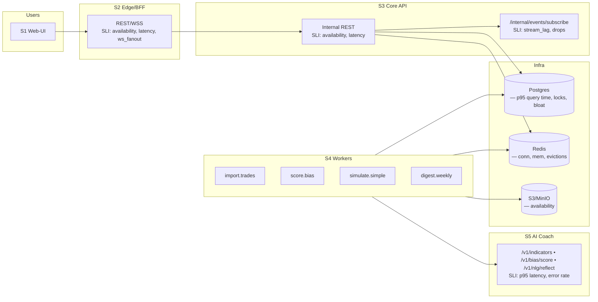

# 09 — Observability & Ops (SLOs, Metrics, Alerts, Runbooks)

## Goals

* See the **health** of each stack (S1–S5) at a glance.
* Catch user-facing regressions **before** users do.
* Keep a small set of **actionable** alerts tied to runbooks.
* Production-ready posture: backups, rotations, DR, privacy.

---

## System Health Map (Mermaid)



---

## SLOs & SLIs (user-centric)

### SLO targets (90-day rolling)

* **Login success path** (Edge+Core): **Availability ≥ 99.9%**, p95 latency ≤ **250 ms**.
* **Coach reflect delivery** (BiasTag → WS bubble): median ≤ **1.5 s**, p95 ≤ **3 s**.
* **Trade import (30 days, 500 trades)** completes ≤ **60 s** p95.
* **Simulation** p95 ≤ **3 s** (cold), ≤ **1 s** (warm cache).
* **Weekly digest** delivered by **Monday 09:00 UTC** for 99% of active users.

### SLIs (how we measure)

* `edge_http_availability = 1 - (5xx + gateway timeouts)/total_requests`
* `core_http_latency_ms = histogram p95`
* `event_delivery_lag_ms = outbox_ts → ws_send_ts`
* `job_duration_ms{job=import|score|sim|digest}`
* `ai_latency_ms{endpoint}` + `ai_error_rate`
* `ws_active_connections`, `ws_drop_rate`
* Infra: `pg_connections`, `pg_locks`, `redis_evictions_total`, `redis_connected_clients`

---

## Metrics (Prometheus)

### Naming (all services)

* Requests: `http_requests_total`, `http_request_duration_seconds_bucket`
* Jobs: `job_duration_ms_bucket`, `queue_depth`
* Events: `event_outbox_writes_total`, `event_delivery_lag_ms_bucket`
* Vendor: `vendor_429_total`, `vendor_req_duration_ms_bucket`
* AI: `ai_request_total`, `ai_request_duration_ms_bucket`, `ai_request_errors_total`
* WS: `ws_active_connections`, `ws_dropped_connections_total`

### Example PromQL (Grafana panels)

```promql
# Edge availability (5m)
1 - sum(rate(http_requests_total{service="edge",code=~"5.."}[5m]))
  / sum(rate(http_requests_total{service="edge"}[5m]))

# Reflect delivery latency p95 (Core→Edge)
histogram_quantile(0.95, sum by (le) (rate(event_delivery_lag_ms_bucket[5m])))

# Import duration p95
histogram_quantile(0.95, sum by (le) (rate(job_duration_ms_bucket{job="import"}[10m])))

# AI error rate
sum(rate(ai_request_errors_total[5m])) / sum(rate(ai_request_total[5m]))

# Redis health
redis_connected_clients
or on() (redis_evicted_keys_total > 0)
```

---

## Alerting (actionable; few and loud)

### Alert Rules (YAML sketch)

```yaml
groups:
- name: product-slos
  rules:
  - alert: EdgeAvailabilityBurn
    expr: (1 - (sum(rate(http_requests_total{service="edge",code=~"5.."}[5m])) / sum(rate(http_requests_total{service="edge"}[5m])))) < 0.999
    for: 10m
    labels: { severity: page }
    annotations:
      summary: "Edge availability below SLO"
      runbook: "https://runbooks/edge-availability"

  - alert: ReflectLatencyP95High
    expr: histogram_quantile(0.95, sum by (le) (rate(event_delivery_lag_ms_bucket[5m]))) > 3000
    for: 10m
    labels: { severity: page }
    annotations:
      summary: "Coach reflect p95 > 3s"
      runbook: "https://runbooks/reflect-latency"

  - alert: ImportBacklogGrowing
    expr: sum(queue_depth{queue="q_import"}) > 200
    for: 15m
    labels: { severity: page }
    annotations:
      summary: "Import backlog > 200 jobs"
      runbook: "https://runbooks/workers-import"

  - alert: AIErrorRateHigh
    expr: (sum(rate(ai_request_errors_total[5m])) / sum(rate(ai_request_total[5m]))) > 0.05
    for: 10m
    labels: { severity: page }
    annotations:
      summary: "AI service errors > 5%"
      runbook: "https://runbooks/ai-coach"

  - alert: PostgresBloatOrLocks
    expr: pg_locks{mode!="AccessShareLock"} > 0 or (pg_stat_progress_vacuum{phase!=""} == 0 and pg_bloat_ratio > 0.3)
    for: 15m
    labels: { severity: ticket }
    annotations:
      summary: "Investigate locks/bloat"
      runbook: "https://runbooks/postgres-maintenance"
```

---

## Logging (JSON schema)

Common fields (all stacks):

```
ts, level, service, env, region, requestId, userId?, route?, method?, status?,
latency_ms?, queue?, job?, jobId?, attempt?, eventId?, broker?, symbol?,
error.code?, error.message?, error.stack? (dev only)
```

* **Redaction:** remove `Authorization`, cookies, any `*Enc` fields.
* **PII:** avoid emails in logs; use `userId`.

---

## Tracing (OpenTelemetry)

* Propagate `traceparent` from Edge → Core → Workers → AI Coach.
* Key spans:

  * Edge: `HTTP /trades/import`, `WS send`
  * Core: `enqueue q_import`, `outbox.append`, `events.replay`
  * Workers: `import.page`, `score.trade`, `sim.run`, `digest.aggregate`
  * AI: `indicators`, `bias.score`, `nlg.reflect`
* Exporter: OTLP → Collector → Tempo/Jaeger.

---

## Dashboards (Grafana layout)

1. **User Journey**

   * Edge availability & p95 latency
   * Reflect delivery p50/p95
   * WS active connections & drop rate

2. **Core & Workers**

   * Queue depth, job durations p95
   * Outbox writes/sec & replay latency
   * Import progress per broker

3. **AI Coach**

   * p95 per endpoint
   * Error rate & timeouts
   * Throughput

4. **Infra**

   * Postgres: connections, slow queries, bloat (pgstattuple), deadlocks
   * Redis: ops/sec, memory, evictions
   * S3: 4xx/5xx, latency (if available)

---

## Runbooks (quick, actionable)

### RB-01 Edge availability

* **Symptoms:** Alert `EdgeAvailabilityBurn`. Users see 5xx.
* **Check:**

  * Edge pods up? `kubectl get deploy edge`
  * Upstream Core reachable? `curl $CORE_BASE/healthz`
  * Rate-limit misconfig? sudden 429 spikes?
* **Actions:**

  * Roll back last Edge deploy.
  * If Core down: fail open? show friendly maintenance page.
  * Validate JWKS URL & JWT signature errors.
* **Post:** RCA with error budget impact.

### RB-02 Reflect latency > 3s

* **Symptoms:** `ReflectLatencyP95High`.
* **Check:**

  * Outbox write time vs WS send time (trace).
  * Worker `score.bias` durations and AI latency.
  * Redis queue depth for `q_score`.
* **Actions:**

  * Scale Workers (SCORE concurrency).
  * Throttle import concurrency if storming.
  * If AI p95 high, switch to simplified heuristics only (feature flag).
* **Post:** tune thresholds, cache OHLCV aggressively.

### RB-03 Import backlog

* **Check:** Redis memory, broker 429s.
* **Actions:** Scale `import` workers; increase backoff; reduce page size; stagger jobs.

### RB-04 AI Coach high error rate

* **Check:** HMAC timestamp skew, rate-limit.
* **Actions:** Restart AI pods; widen skew window temporarily; reduce request volume.
* **Fallback:** Serve deterministic heuristics from Workers without NLG.

### RB-05 Postgres locks/bloat

* **Check:** `pg_locks`, long-running tx, table size growth.
* **Actions:** Cancel offenders; run `VACUUM (FULL)` during low-traffic; ensure partition pruning on `EventOutbox`.
* **Prevent:** Autovacuum tuned; monthly partitions; proper indexes.

### RB-06 Redis down / evictions

* **Check:** `redis_evictions_total`, memory usage.
* **Actions:** Increase maxmemory; enable `allkeys-lru`; scale vertically; purge stale caches.
* **Impact:** Queue pauses; import temporarily degraded.

### RB-07 SSE/WS fanout drops

* **Check:** Edge SSE connection to Core, reconnect count.
* **Actions:** Restart subscriber; verify timeouts; reduce event batch size.

### RB-08 JWT key rotation

* **Checklist:**

  * Publish new JWKS (Core), keep old for overlap.
  * Rotate signing key; Edge caches JWKS every 5m.
  * Validate mixed traffic success.
  * Decommission old key after 24h.

---

## Privacy, Security, Compliance

* **PII minimization:** no emails in logs/metrics; only `userId`.
* **Secrets:** KMS-managed; tokens sealed AES-GCM (DEK per tenant).
* **Backups:**

  * Postgres: base backup nightly + WAL; retain 14 days.
  * S3: versioning on for `digests/` & exports; lifecycle to IA after 30d.
* **DR:** Restore drills quarterly; RTO 4h, RPO 15m.
* **Data retention:** `EventOutbox` 90d; `Digest` 6m in DB (archive to S3).
* **Deletion:** Hard-delete tokens/sessions; trade deletion policy per privacy copy.
* **Pen-test readiness:** CSP/HSTS set at Edge; package scans (Trivy) in CI.

---

## Release & Feature Flags

* **Environments:** dev → staging → prod (progressive delivery).
* **Flags:**

  * `FEATURE_BINANCE`, `FEATURE_VENDOR_FALLBACK`, `AI_STRICT_MODE`, `HEURISTICS_ONLY`.
* **Canary:** 10% traffic for 30 min; auto-rollback if SLO probes fail.
* **Schema changes:** expand → backfill → contract (3-step); guard behind flags.

---

## Synthetic Probes

* **Login probe:** scripted user logs in; expects 200 <250ms.
* **Import probe:** mock broker returns 50 trades; expects `import.progress` → 100% within 60s.
* **Reflect probe:** inject outbox row; Edge WS receives within 3s.
* **AI probe:** indicators on fixture; compares hash of outputs.

---

## Checklists

### Pre-deploy

* Migrations applied? (`prisma migrate deploy`)
* Feature flags set?
* SLO probes green?
* Error budget not exhausted?

### Post-deploy

* Watch dashboards 30 min.
* Review canary metrics & traces.
* Flip traffic to 100% if clean.

---

## Tooling

* **Prometheus** + **Grafana** dashboards (as code via Jsonnet or Terraform).
* **Loki** for logs; **Tempo/Jaeger** for traces.
* **Sentry** for error tracking (Edge/Core/AI; PII scrubbing enabled).

---

## Open Questions

* Adopt PG **LISTEN/NOTIFY** for outbox live tail vs polling? (Later; adds complexity.)
* Multi-region WS relay (sticky vs global fanout)? (Later; start single-region.)

---
