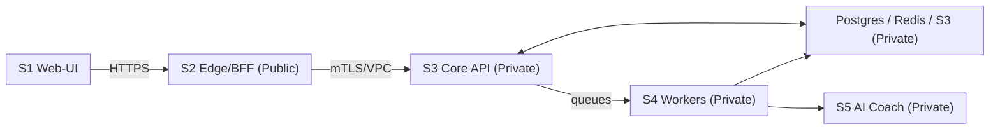

# 10 — Security Playbook (Production-Ready, MVP Scope)

> Scope covers **S1 Web-UI**, **S2 Edge/BFF**, **S3 Core API**, **S4 Workers**, **S5 AI Coach**, plus **Postgres/Redis/S3**. Controls map to our entities and flows from “01–09”.

---

## 0) TL;DR (“Security Contract”)

* **Auth:** Short-lived **JWT (RS256, 15m)** issued by Core, stored in **HttpOnly; Secure; SameSite=Lax** cookie at Edge.
* **CSRF:** **Double-submit** cookie + `X-CSRF-Token` on all mutating requests at Edge.
* **Secrets:** Broker tokens **AES-GCM sealed** with **per-tenant DEK**; DEK wrapped by **KMS KEK**.
* **Events:** User events via **Event Outbox**; no secrets/PII in payloads.
* **AI calls:** **HMAC** headers (`X-KeyId`, `X-Timestamp`, `X-Signature`) + ±5m skew; plan **mTLS** later.
* **Rate limits & Idempotency:** Edge enforces Idempotency-Key; rate limits at Edge; retries with backoff in Workers.
* **Storage:** PII minimization; partitioned outbox; S3 versioning; Postgres backups + WAL; Redis no-persistence.
* **Headers:** HSTS, CSP, Referrer-Policy, Permissions-Policy set at Edge.
* **Logging:** No secrets or emails; userId only; redaction filters on auth/proxy logs.
* **Compliance:** Export/delete endpoints; 90-day outbox retention, 6-month digest retention.

---

## 1) Threat Model (STRIDE)

### 1.1 Trust Boundaries (Mermaid)



### 1.2 Risks & Controls (Summary)

| STRIDE                | Risk Example                    | Where | Primary Controls                                                          |
| --------------------- | ------------------------------- | ----- | ------------------------------------------------------------------------- |
| **S**poofing          | Cookie theft / session replay   | S1↔S2 | HttpOnly cookies, short JWT, JWKS rotation, IP/UA hash audit              |
| **T**ampering         | Event payload altered           | S3↔S2 | Outbox in DB, signed JWT auth, DTO validation                             |
| **R**epudiation       | “I didn’t link broker”          | S2/S3 | Audit table with action+ts+ipHash+uaHash                                  |
| **I**nfo disclosure   | Token leakage in logs           | S3/S4 | Token sealing, log redaction, accessEnc never logged                      |
| **D**enial of service | WSS fanout storm / import storm | S2/S4 | Rate limits, queue backpressure, circuit breakers                         |
| **E**levation         | Bypass CSRF or authz            | S2    | CSRF double-submit; `requireUser`; `X-User-Id` set only from verified JWT |

---

## 2) Data Classification & Policy

| Class            | Examples                        | Storage                   | Transport | Retention                             |
| ---------------- | ------------------------------- | ------------------------- | --------- | ------------------------------------- |
| **Secret**       | `accessEnc`, `refreshEnc`, DEKs | Postgres (sealed AES-GCM) | TLS only  | Until revoked                         |
| **PII**          | `email`                         | Postgres                  | TLS       | Indefinite (user delete supported)    |
| **Pseudonymous** | `ipHash`, `uaHash`              | Postgres                  | TLS       | 90 days                               |
| **Financial**    | trades `price/qty/fee`          | Postgres                  | TLS       | By policy; export/delete supported    |
| **Low**          | Bias features, digests          | Postgres/S3               | TLS       | Outbox 90d, Digest 6m (archive to S3) |

**No raw IP or UA stored**; only hashed forms with pepper.

---

## 3) Identity, Sessions, CSRF

* **JWT**: RS256, 15m TTL; `kid`/JWKS published by Core.
* **Cookie** (`session`): `HttpOnly; Secure; SameSite=Lax; Path=/; Domain=<edge-domain>`.
* **Refresh**: Short access tokens; refresh via login endpoint (can add refresh token later).
* **CSRF**: Non-HttpOnly `csrf_token` cookie + `X-CSRF-Token` header validated at Edge on **mutating** requests.
* **Authorization**: Edge extracts `userId` from verified JWT; forwards to Core as `Authorization: Bearer <jwt>`.

---

## 4) Cryptography

### 4.1 Token Sealing (Core/Workers)

* **Per-tenant DEK** (random 256-bit) stored **encrypted** by KMS **KEK**.
* **AES-GCM** to seal broker tokens; store `nonce|ciphertext|tag`.
* Rotation: rewrap DEKs quarterly or when KEK rotates.

```ts
// tokenSeal.ts (pseudocode)
export async function sealTokens(raw: string, dek: Buffer): Promise<Buffer> {
  const iv = crypto.randomBytes(12);
  const cipher = crypto.createCipheriv('aes-256-gcm', dek, iv);
  const ct = Buffer.concat([cipher.update(raw,'utf8'), cipher.final()]);
  const tag = cipher.getAuthTag();
  return Buffer.concat([iv, ct, tag]); // store in accessEnc
}

export async function openTokens(enc: Buffer, dek: Buffer): Promise<string> {
  const iv = enc.subarray(0,12), tag = enc.subarray(enc.length-16), ct = enc.subarray(12, enc.length-16);
  const dec = crypto.createDecipheriv('aes-256-gcm', dek, iv); dec.setAuthTag(tag);
  return Buffer.concat([dec.update(ct), dec.final()]).toString('utf8');
}
```

### 4.2 HMAC for AI Coach

* Signature over `timestamp + body`.
* Headers: `X-KeyId`, `X-Timestamp`, `X-Signature`.
* Reject skew > ±300s; optional nonce cache.

```ts
// client side (Core/Workers)
const ts = new Date().toISOString().replace(/\.\d+Z$/,'Z');
const sig = hmacSHA256(secret, ts + body).hex();
fetch('/v1/bias/score',{ headers:{'X-KeyId':kid,'X-Timestamp':ts,'X-Signature':sig}});
```

---

## 5) Network & Platform

* **Segmentation:**

  * S2 Edge: public ingress only.
  * S3/S4/S5 & Data plane: private subnets; no public IPs.
* **Transport:** TLS everywhere; disable TLS < 1.2.
* **Kubernetes (if used):** PodSecurity, NetworkPolicies, only necessary egress, read-only root FS where possible.
* **Images:** Build with pinned versions; scan with Trivy; sign images (Cosign); verify in admission.

---

## 6) Service Security Controls

### 6.1 Edge/BFF

* Validate JWT via **JWKS**; cache keys; handle rotation.
* Enforce **Idempotency-Key** on sensitive POSTs.
* **Rate limits**: IP+user; 429 with `Retry-After`.
* **Headers**:

  * `Strict-Transport-Security: max-age=31536000; includeSubDomains`
  * `Content-Security-Policy: default-src 'self'; img-src 'self' data:; script-src 'self' 'strict-dynamic'; style-src 'self' 'unsafe-inline'; connect-src 'self' https: wss:; frame-ancestors 'none'`
  * `Referrer-Policy: no-referrer`
  * `Permissions-Policy: geolocation=(), microphone=(), camera=()`
  * `X-Content-Type-Options: nosniff`

### 6.2 Core API

* Auth middleware verifies JWT on **every** request.
* Zod DTO validation for all routes; centralized error handler.
* **Idempotency** handler (Redis) for POSTs.
* **Outbox** only contains user-safe payloads.
* **Audit** each critical action.

### 6.3 Workers

* Backoff with jitter for 429/5xx; bounded retries + DLQ.
* Never log token values or broker payloads with secrets.
* Cache OHLCV in Redis; evict on memory pressure.

### 6.4 AI Coach

* Enforce HMAC & rate limits; body size cap (≤512 KB).
* Deterministic, no external network calls (besides Core/Workers).
* Output clamps (length, character set) to avoid prompt-style attacks.

---

## 7) Storage Security

### Postgres

* Enforce TLS.
* Separate roles: `app_ro`, `app_rw`, `migrations`.
* **Row-level** scoping by `userId` in queries (application-level).
* Autovacuum tuning; partitioned `EventOutbox` by month.
* Backups: nightly base + WAL; restore test monthly.

### Redis

* Private only; AUTH on; no persistence for queues cache (RDB/AOF off).
* Memory policy `allkeys-lru`; alarms on evictions.
* Min TLS (if managed service supports).

### S3/MinIO

* Private buckets; signed URLs for downloads; short TTL.
* Server-side encryption (SSE-S3 or SSE-KMS).
* Versioning ON for `digests/` and exports; lifecycle rules.

---

## 8) Input Validation & Output Encoding

* **Zod** (TS) at Edge/Core; **Pydantic** at AI Coach.
* Deny unknown fields; strict types; size limits (string lengths, arrays).
* Output JSON only; never reflect raw user HTML into UI without escaping.
* Symbols & broker data normalized early (charset, casing).

---

## 9) Secure Coding & Supply Chain

* **Dependencies**: lockfiles committed; Dependabot enabled.
* **SAST**: CodeQL on PRs.
* **SBOM**: generate (CycloneDX) in CI; attach to docker images.
* **Image Scans**: Trivy fail-the-build on criticals.
* **Signing**: Cosign sign images; verify in admission.
* **Repro builds**: pin base images & Node/Python versions.
* **Secrets**: never in env-committed files; use Secret Manager/SealedSecrets.

---

## 10) Abuse & DoS Mitigations

* **Edge:** token bucket RL; per-route budgets; slow-loris protection (header/body timeouts).
* **Workers:** max concurrency; backpressure via queue depth; circuit breaker for vendor storms.
* **WSS:** cap connections per user; heartbeat + idle timeouts; backpressure on send queue.
* **Simulations:** cache; limit horizonDays; Idempotency-Key required.

---

## 11) Privacy & Data Subject Rights

* **Export**: S3 export (signed URL).
* **Delete**: Hard-delete tokens/sessions; delete trades/bias; archive digests; remove outbox rows beyond retention.
* **Consent**: Explicit broker connect; scope shown; audit logged.
* **Policy**: Document retention periods; disclose analytics metrics (non-PII).

---

## 12) Incident Response

### Severity Levels

* **SEV-1**: user login down or data exposure suspected.
* **SEV-2**: reflect latency > 3x SLO; imports stuck globally.
* **SEV-3**: Degraded, partial region impact.

### Workflow

1. **Detect** (alert fires) → **On-call** acknowledges.
2. **Triage** with runbooks (09).
3. **Mitigate** (rollback/scale/feature-flag).
4. **Comms**: status page + stakeholder channel.
5. **RCA** within 48h; commit action items (owner, due date).

**Forensics:** immutable logs; preserve relevant S3 objects; DB snapshots.

---

## 13) Access Management

* Production access via SSO + MFA.
* Principle of least privilege in cloud IAM; break-glass accounts monitored.
* CI/CD deploys with scoped service accounts; no developer long-lived creds on prod.

---

## 14) Checklists

### Pre-Prod Go-Live

* [ ] Edge headers set (CSP/HSTS/etc.).
* [ ] JWKS reachable; key rotation tested.
* [ ] Broker token sealing round-trip test.
* [ ] Rate limits tuned; synthetic probes green.
* [ ] Backups & restore test succeeded.
* [ ] SBOM & image scans clean (no criticals).

### Weekly

* [ ] Rotate CSRF pepper (optional).
* [ ] Review alerts & adjust thresholds.
* [ ] Check outbox partitions/bloat.

### Quarterly

* [ ] DEK rewrap with latest KEK.
* [ ] Restore drill from backups.
* [ ] Key rotation dry run.

---

## 15) Pen-Test Plan (MVP)

* **Black-box** on Edge/Core: auth, CSRF, IDOR, rate limits, SSRF via broker callbacks.
* **Grey-box** review: token sealing, HMAC verification, event replay/authZ.
* **Static review**: SBOM, dependency vulns, secrets in repo.
* **Fix window**: 30 days to remediate high/critical.

---

## 16) Roadmap (Post-MVP Hardening)

* **mTLS** between S2–S3–S4–S5.
* **JWT refresh tokens** (rotating, bounded).
* **PG LISTEN/NOTIFY** for outbox live tail + logical replication for analytics.
* **WAF** at Edge; anomaly-based blocking.
* **Hardware-backed keys** (HSM) for JWT signing & KEK.
* **Fine-grained rule personalizations** with policy engine (e.g., OPA) guarded by unit tests.
* **Multi-region failover** for WS relay.

---

## 17) Appendix — Example Config Snippets

### CSP (Edge)

```
Content-Security-Policy:
  default-src 'self';
  img-src 'self' data:;
  script-src 'self' 'strict-dynamic';
  style-src 'self' 'unsafe-inline';
  connect-src 'self' https: wss:;
  frame-ancestors 'none';
```

### Cookie (Edge)

```
Set-Cookie: session=<JWT>; HttpOnly; Secure; SameSite=Lax; Path=/; Max-Age=900
Set-Cookie: csrf_token=<rand>; Secure; SameSite=Lax; Path=/
```

### Postgres (minimal)

```
ssl=on
max_connections tuned
log_min_duration_statement=500ms
```

---

## 18) RACI (Security Ownership)

| Area              | R       | A             | C             | I       |
| ----------------- | ------- | ------------- | ------------- | ------- |
| JWT keys/JWKS     | Core    | Security Lead | Edge          | All     |
| Token sealing/KMS | Core    | Security Lead | Workers       | All     |
| CSP/HSTS          | Edge    | Security Lead | Web-UI        | All     |
| Backups/Restore   | Infra   | CTO           | Core          | All     |
| Incidents/Comms   | On-call | CTO           | Security Lead | Company |

---
