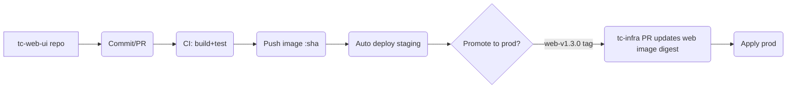
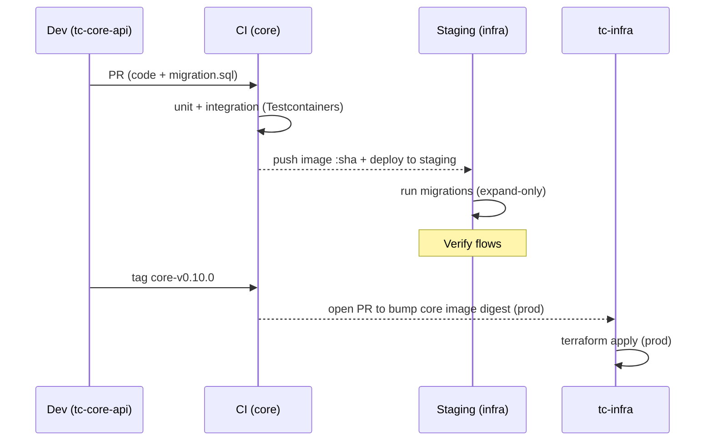
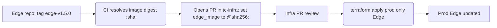

# Polyrepo Architecture & Dev Flow

> Same stacks (S1–S5), but each deployable lives in its **own repo**. Shared contracts are a **versioned library** published to a registry. Infra/deploy is driven from a separate **infra repo**.

---

## 0) Repo topology

```
repos/
  tc-web-ui           # S1 (Next.js)
  tc-edge-bff         # S2 (Express/Fastify, REST+WS)
  tc-core-api         # S3 (Node, DB + outbox)
  tc-workers          # S4 (BullMQ jobs)
  tc-ai-coach         # S5 (FastAPI, Python)
  tc-contracts        # Shared Zod DTOs → JSON Schema
  tc-infra            # Terraform for Cloud Run, Neon, Upstash, R2
  tc-mobile           # (optional) React Native
```

**Golden rule:** Everything that ships as its own container = its own repo.
**Contracts** are the *only* shared code across repos.

---

## 1) How contracts are shared

**tc-contracts** (TS + Zod) → publish on every release:

* **NPM package**: `@tc/contracts@X.Y.Z` (private registry).
* **Schemas artifact**: bundle `schemas/*.json` (from zod-to-json-schema) and publish it as:

  * a **GitHub Release asset**, and
  * an **OCI artifact** to GHCR (e.g., `ghcr.io/org/contracts-schemas:X.Y.Z`).

**Consumers:**

* Node services (Edge/Core/Workers/Web/Mobile) add `"@tc/contracts": "^X.Y.Z"`.
* **AI (Python)** downloads the **schemas artifact** for the pinned version and runs codegen → Pydantic models.

**Upgrades automated:** Renovate/Dependabot opens PRs in each service to bump `@tc/contracts`.

---

## 2) Versioning & tags (polyrepo)

* **Libraries (tc-contracts)**: **semver** (`contracts-v0.3.2`).

  * MINOR = additive, backward-compatible.
  * MAJOR = breaking; coordinate rollout (see §5.3).

* **Services (Edge/Core/Workers/AI/Web)**:

  * Build container per commit; image tagged by **git SHA**.
  * Create **service tags** when promoting to prod:

    * `edge-v1.5.0`, `core-v0.10.1`, `workers-v0.7.0`, `ai-v0.4.2`, `web-v1.3.0`.

* **Infra (tc-infra)**:

  * Holds environment state (Terraform).
  * Stores **pinned image digests** (staging/prod) per service.

---

## 3) CI/CD per repo (summary)

* **Service repos (Edge/Core/Workers/AI/Web)**

  * PR → build & test → **push image** to registry on `main`.
  * Auto-deploy **staging** using the *new image digest*.
  * **Prod** deploy happens when you push a **service tag** (`edge-v*`, `core-v*`, …). Infra updates just that service to the **already built digest** (no rebuild drift).

* **tc-contracts**

  * PR → tests + schema diff → **publish** `@tc/contracts@X.Y.Z` + attach schemas artifact.
  * Renovate/Dependabot PRs open across consumers to bump the version (or you cherry-pick repos manually).

* **tc-infra**

  * Holds Terraform.
  * When a service tag is pushed, an automation PR updates the corresponding **image digest** input for that service/environment and applies.

---

## 4) End-to-end dev flows (diagrams)

### 4.1 UI-only change (no backend impact)



### 4.2 Contracts additive change (non-breaking)

```mermaid
flowchart LR
  A[tc-contracts] --> B(Release contracts-v0.3.2)
  B --> C(Publish NPM + Schemas artifact)
  C --> D[Renovate PRs]:::pr --> E1[tc-edge-bff]
  C --> D2[Renovate PRs]:::pr --> E2[tc-core-api]
  C --> D3[Renovate PRs]:::pr --> E3[tc-workers]
  C --> D4[Renovate PRs]:::pr --> E4[tc-web-ui]
  C --> D5[Renovate PRs]:::pr --> E5[tc-ai-coach (pull schemas)]
  classDef pr fill:#eef,stroke:#55f
```

Each consumer repo merges its bump PR, CI verifies contract tests, staging redeploys only that service.

### 4.3 Core change with DB migration



### 4.4 Breaking contracts change (coordinated)

```mermaid
sequenceDiagram
  participant C as tc-contracts
  participant P as Providers (Edge/Core)
  participant U as Consumers (Web, Mobile, Workers, AI)

  C->>C: Release contracts v1.0.0 (adds v2 payloads; keep v1 for grace)
  C-->>P: Renovate bumps providers
  P->>P: Providers emit both v1 & v2 payloads
  C-->>U: Renovate bumps consumers
  U->>U: Consumers switch to v2, still accept v1
  Note right of U: After adoption window
  P->>P: Providers stop v1 (contract phase-out)
```

**Key:** Emit **both** versions for a window; remove old after consumers migrate.

---

## 5) Repos: responsibilities & CI highlights

### 5.1 Service repos (Edge/Core/Workers/AI/Web)

* **Branching:** trunk-based (`main`), short-lived feature branches.
* **CI checks:** lint, unit/integration tests, contract tests (JSON Schema/Pact).
* **Artifacts:** Docker image tagged `:sha`.
* **Staging deploy:** on merge to `main` (only this service).
* **Prod deploy:** push `service-vX.Y.Z` tag → automation PR in **tc-infra** to bump digest.

### 5.2 Contracts repo

* **Source:** Zod schemas + generator to `schemas/*.json`.
* **Release:** Changesets → `contracts-vX.Y.Z`.
* **CI:** schema diff check (block breaking unless MAJOR), publish NPM + schemas artifact.
* **Notifications:** Renovate opens bumps in consumer repos.

### 5.3 Infra repo

* **Terraform** modules for Cloud Run/Neon/Upstash/R2.
* **Env directories**: `envs/staging.tfvars`, `envs/prod.tfvars` pin **image digests**.
* **CI/CD:** On “service tag” in any repo, a bot opens a PR in **tc-infra** to set:

  ```hcl
  core_image = "asia.../core@sha256:<digest>"
  ```

  Merge → `terraform apply` updates only that service.

---

## 6) Contract testing across repos

* **Schema validation:** providers import `@tc/contracts` and validate outgoing payloads; consumers validate incoming.
* **Pact Broker (optional):** host a Pact Broker (or GH Pages) so providers verify against latest consumer contracts *before* release.
* **AI (Python):** in `tc-ai-coach`, pipeline downloads the **schemas artifact** for the pinned version, runs codegen → Pydantic models; tests validate round-trips.

---

## 7) Pros & cons vs monorepo

**Pros**

* Independent repo ACLs & audit trails.
* Clean ownership per team.
* CI faster per repo (smaller scope).
* Infra changes reviewed separately.

**Cons**

* Cross-repo changes require choreography.
* Contracts bumps propagate via PRs to many repos.
* Harder to run “whole world” locally (use `docker-compose` templates).

**When polyrepo shines:** multiple teams, distinct release cadences, stricter compliance boundaries.

---

## 8) Practical conventions (copy/paste)

**Tag patterns**

* Services: `edge-v1.5.0`, `core-v0.10.1`, `workers-v0.7.0`, `ai-v0.4.2`, `web-v1.3.0`
* Contracts: `contracts-v0.3.2`

**Branch names**

* `feat/<topic>`, `fix/<ticket>`, `chore/<task>`

**Commit style** (optional Conventional Commits)

* `feat(core): add what-if sim horizon`
* `fix(edge): correct CSRF header`

**Release cadence**

* Staging deploys continuously from `main`.
* Prod deploys happen via **service tags**, ideally batched once/twice a day.

---

## 9) Example: polyrepo promotion path (service tag)



---

## 10) Migration note (mono → poly)

* Start monorepo (fastest), then **split** when teams/velocity demand it.
* When splitting:

  1. Extract each `apps/*` tree into its repo, keep history (git filter-repo).
  2. Move `packages/contracts` to **tc-contracts**; publish v1.0.0.
  3. Add Renovate to bump contracts in all services.
  4. Stand up **tc-infra** repo with current image digests → deploy parity check.
  5. Flip CI in each service to update **staging** directly & open **tc-infra** PRs for prod.

---

### TL;DR

* **Polyrepo works well**: one repo per deployable (+ contracts + infra).
* Use a **published contracts library** + **schemas artifact** to keep services in lock-step.
* **Service tags** drive production releases; **infra repo** applies them.
* Renovate/Dependabot handles the **version bump PRs** across repos.
* Pact/Schema checks keep everyone honest.
