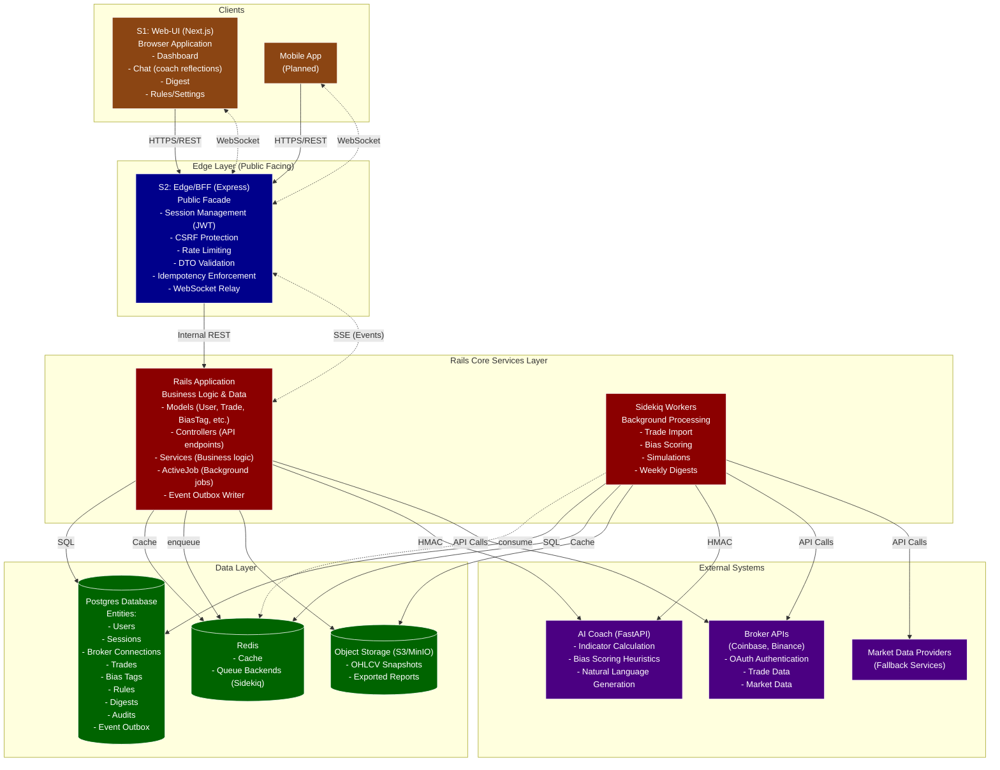

# Rails-Based System Architecture Diagram

This diagram shows the complete architecture of the trading platform with Ruby on Rails as the core implementation technology.

## Component Responsibilities

### S1: Web-UI (Next.js)
- User-facing web application
- Dashboard with trading insights
- Chat interface for coach reflections
- Weekly digest viewer
- Rules and settings management
- Uses cookie-based sessions (no direct DB access)
- Communicates with Edge via REST and WebSocket

### S2: Edge/BFF (Express)
- Public API facade for web and mobile clients
- Session management with JWT tokens
- CSRF protection and rate limiting
- DTO validation and idempotency enforcement
- WebSocket relay with event replay capability
- No direct database access - proxies requests to Rails Core

### Rails Application
- Central business logic and data management using Ruby on Rails
- Implements all domain entities as ActiveRecord models
- Exposes internal REST API consumed by Edge
- Uses Service Objects for business logic
- Implements EventOutbox pattern for real-time events
- Enqueues background jobs using ActiveJob

### Sidekiq Workers
- Background job processing using ActiveJob with Sidekiq backend
- Trade import from broker APIs
- Bias scoring using AI Coach service
- Trade simulations
- Weekly digest generation
- Uses Redis for job queues and caching

### S5: AI Coach (FastAPI)
- Provides AI-powered services to Rails application
- Calculates trading indicators
- Applies heuristic bias scoring
- Generates natural language reflections
- Secured with HMAC-signed requests

### Data Layer
- Postgres: Primary database with all business entities (ActiveRecord models)
- Redis: Caching and job queue backends for Sidekiq
- S3: Object storage for snapshots and reports

### External Systems
- Broker APIs: Primary source of trading data
- Market Data Providers: Fallback data sources
- AI Coach: Python-based AI services

## Key Implementation Details

1. **ID Generation**: All entities use nanoid instead of cuid for ID generation
2. **API Compatibility**: Rails exposes the same internal REST API as the previous Express implementation
3. **Background Jobs**: ActiveJob with Sidekiq replaces BullMQ for background processing
4. **Event System**: EventOutbox pattern maintained for real-time events with SSE support
5. **Security**: Rails' built-in security features handle CSRF, parameter sanitization, and session management
6. **Integration**: Rails services encapsulate integration logic with brokers and market data providers