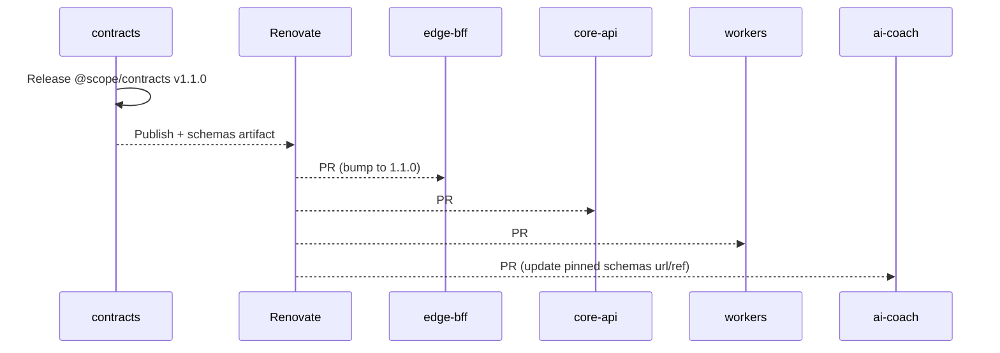

# Shared Contracts in Polyrepo — Playbook

## 0) What & why

* **Repo:** `contracts` (TypeScript + Zod).
* **Outputs:**

  1. **NPM package** `@<scope>/contracts` (TS types + Zod validators)
  2. **JSON Schemas** (for Python AI codegen)
* **Consumers:**

  * Node services (web-ui, edge-bff, core-api, workers, mobile): import Zod + types.
  * Python AI (ai-coach): generate Pydantic models from JSON Schemas.

---

## 1) Repository layout (`contracts`)

```
contracts/
  src/
    index.ts             # exports all entities/events
    entities/*.ts        # User, Trade, BiasTag, WeeklyDigest...
    events/*.ts          # import.progress, coach.reflect, digest.ready
  scripts/
    gen-schemas.ts       # zod → JSON Schema (one file per type)
  package.json
  tsconfig.json
  .changeset/            # semantic versioning (Changesets)
```

**package.json (core bits)**

```json
{
  "name": "@scope/contracts",
  "version": "1.0.0",
  "type": "module",
  "main": "dist/index.cjs",
  "module": "dist/index.js",
  "types": "dist/index.d.ts",
  "files": ["dist", "schemas"],
  "scripts": {
    "build": "tsup src/index.ts --dts --format cjs,esm",
    "gen:schemas": "ts-node scripts/gen-schemas.ts",
    "release": "changeset version && npm publish --access=restricted"
  },
  "dependencies": {
    "zod": "^3.23.8",
    "zod-to-json-schema": "^3.23.5"
  },
  "devDependencies": {
    "tsup": "^8.0.1",
    "typescript": "^5.6.2",
    "ts-node": "^10.9.2",
    "@changesets/cli": "^2.27.7"
  }
}
```

**scripts/gen-schemas.ts (sketch)**

```ts
import { zodToJsonSchema } from "zod-to-json-schema";
import * as fs from "fs"; import * as path from "path";
import { Trade, BiasTag, WeeklyDigest, EventEnvelope,
         EImportProgress, ECoachReflect, EDigestReady } from "../src";

const artifacts = { Trade, BiasTag, WeeklyDigest, EventEnvelope, EImportProgress, ECoachReflect, EDigestReady };
const out = path.join(process.cwd(), "schemas"); fs.mkdirSync(out, { recursive: true });
for (const [name, schema] of Object.entries(artifacts)) {
  fs.writeFileSync(path.join(out, `${name}.schema.json`), JSON.stringify(
    zodToJsonSchema(schema, { name, target: "jsonSchema7" }), null, 2
  ));
}
```

---

## 2) Versioning & breaking changes

* **Semver via Changesets**:

  * **MINOR**: additive, backward-compatible (new optional fields, new event types).
  * **MAJOR**: breaking (removed/renamed/required changes).
* **Event payloads carry a version** in their **envelope** (`v`). For MAJOR changes:

  1. Providers **dual-emit** (old `v1` + new `v2`) for a grace window.
  2. Consumers upgrade to `v2` while still accepting `v1`.
  3. Remove `v1` after adoption.

**Schema drift guard (CI):** diff `schemas/*.json`; fail if a field changes type/requiredness without a MAJOR bump.

---

## 3) Publishing & artifacts

**Registry options (pick one):**

* GitHub Packages (private), or
* npm org (private), or
* Self-hosted Verdaccio (internal).

**Release pipeline (contracts repo)**

1. PR with Changeset → merge to `main`.
2. Release job:

   * `npm version` by Changesets
   * `npm publish` (2FA/provenance recommended)
   * run `gen:schemas` and **attach schemas** zip to the GitHub Release (optional but handy for Python).

**Security:**

* Enable **2FA** for publishes, or npm provenance.
* Avoid embedding secrets; no PII in schemas.

---

## 4) Consuming in Node services (web/edge/core/workers/mobile)

**Install**

```bash
npm i @scope/contracts@^1.0.0
```

**Use**

```ts
import { EventEnvelope, ECoachReflect, Trade } from "@scope/contracts";

const env = EventEnvelope.parse(incoming); // runtime validate
if (env.type === "coach.reflect") {
  const payload = ECoachReflect.parse(env.payload);
  // safe usage...
}
```

**CI guard**

* Add a small test that validates a few sample payloads against Zod.
* Pin version in `package.json` and let Renovate open bump PRs.

---

## 5) Consuming in Python AI (ai-coach)

**Step A — fetch schemas for the pinned contracts version**

* Option 1: download attached **release asset** (schemas.zip).
* Option 2: download the **NPM tarball** and read `package/schemas/*.json`.

**Step B — codegen Pydantic v2**

```bash
pip install datamodel-code-generator pydantic
datamodel-codegen --input schemas/ECoachReflect.schema.json \
  --input-file-type jsonschema \
  --output-model-type pydantic_v2.BaseModel \
  --target-python-version 3.11 \
  --output models/ECoachReflect.py
```

**Use**

```python
from models.EventEnvelope import EventEnvelope
from models.ECoachReflect import ECoachReflect

env = EventEnvelope.model_validate(incoming)
assert env.type == "coach.reflect"
payload = ECoachReflect.model_validate(env.payload)
```

**CI guard**

* Generate models on every build; validate round-trip (json → model → json).

---

## 6) Automation across repos

**Renovate/Dependabot (recommended)**

* Enable in **web-ui, edge-bff, core-api, workers, mobile, ai-coach**.
* Rule to auto-open PRs for `@scope/contracts`.

`renovate.json` (snippet)

```json
{
  "extends": ["config:recommended"],
  "packageRules": [
    {
      "matchPackagePatterns": ["^@scope/contracts$"],
      "groupName": "contracts",
      "automerge": false,
      "schedule": ["at any time"]
    }
  ]
}
```

**Contracts → Consumers flow**



---

## 7) Contract tests & gateways

* **Schema validation** at boundaries in Node: `EventEnvelope.parse`, then `SpecificEvent.parse`.
* **Pact (optional):** Host a Pact Broker; consumers publish expectations; providers verify before release.
* **Build gates (every service):**

  * Contracts version bump → run consumer tests with the new version.
  * Fail if incompatible (forces either code change or wait for a compatible contracts release).

---

## 8) Release cheat sheet

**Contracts release**

```bash
# In contracts repo
pnpm changeset        # mark minor/major
pnpm changeset version
npm publish           # or GH Packages
# CI also uploads schemas artifact
```

**Service upgrades**

* Merge Renovate PR in each service → deploys that service to **staging**.
* Promote to prod by **service tag** (unchanged process).

---

## 9) Alternatives (when registry is not desired)

* **Git tag dependencies** in Node (`"@scope/contracts": "github:org/contracts#v1.1.0"`).
  Pros: fewer infra pieces. Cons: slower installs, no provenance, less standard.
* **Git submodule** of `schemas/` for Python AI only.
  Still publish the TS package for Node services.

(Registry + Renovate is the smoothest for most teams.)

---

## 10) Quick “getting started” checklist

* [ ] Create `contracts` repo; scaffold as above.
* [ ] Turn on **Changesets**; protect `main`.
* [ ] Wire **CI**: build → schema diff guard → publish on tag/release.
* [ ] Publish `@scope/contracts@1.0.0` + attach `schemas.zip`.
* [ ] Add dependency in **web-ui, edge-bff, core-api, workers, mobile**.
* [ ] Add **schemas fetch + codegen** step in **ai-coach** CI.
* [ ] Enable **Renovate** on all consumer repos.

---
